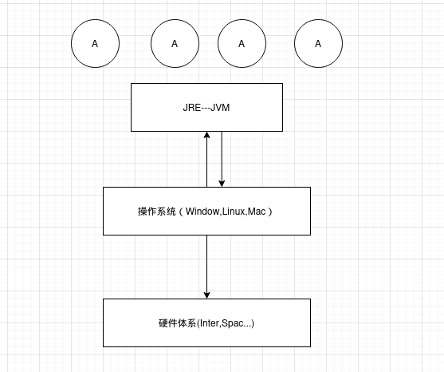
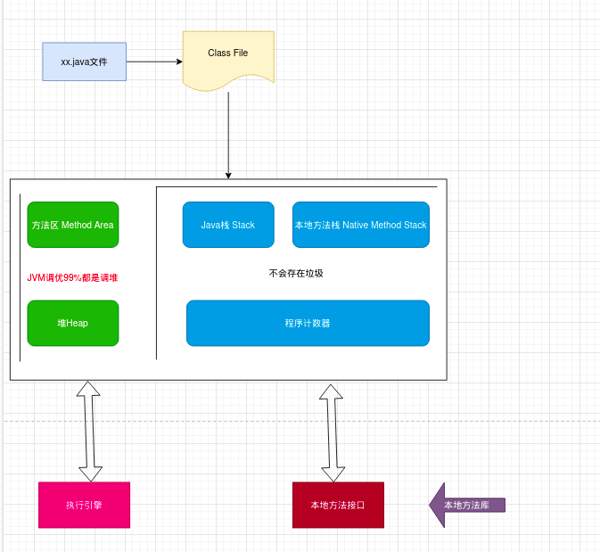
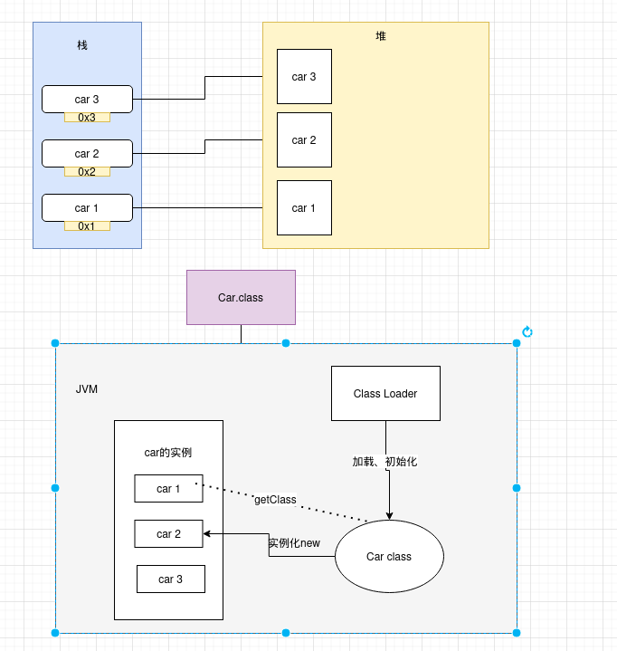
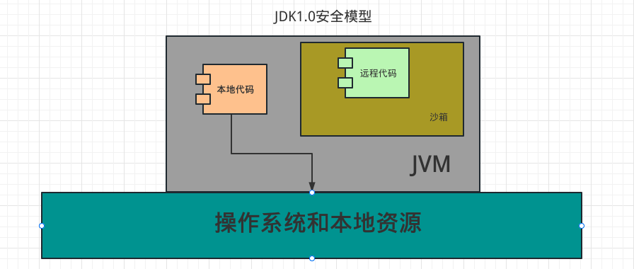
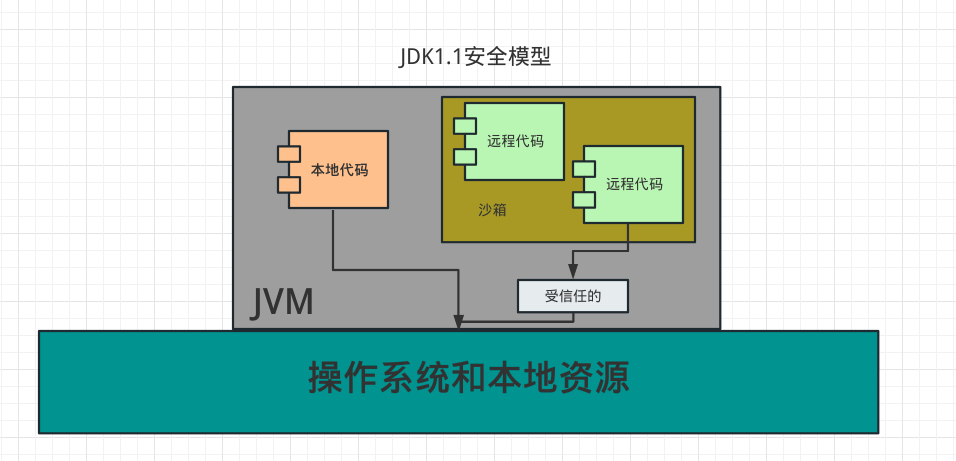
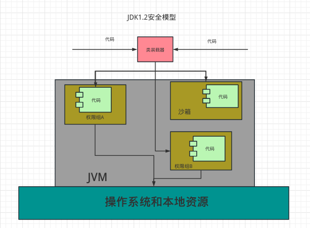
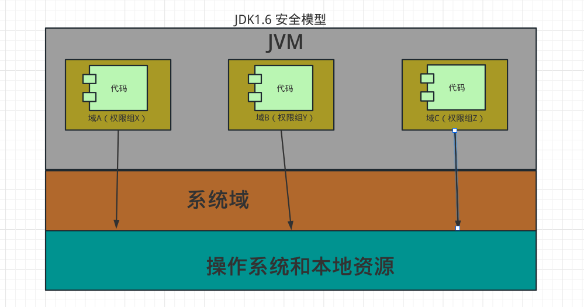
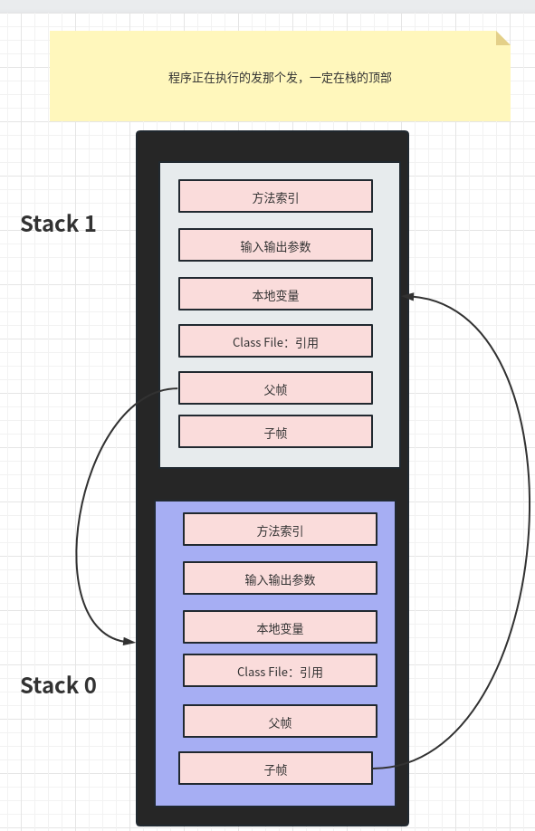
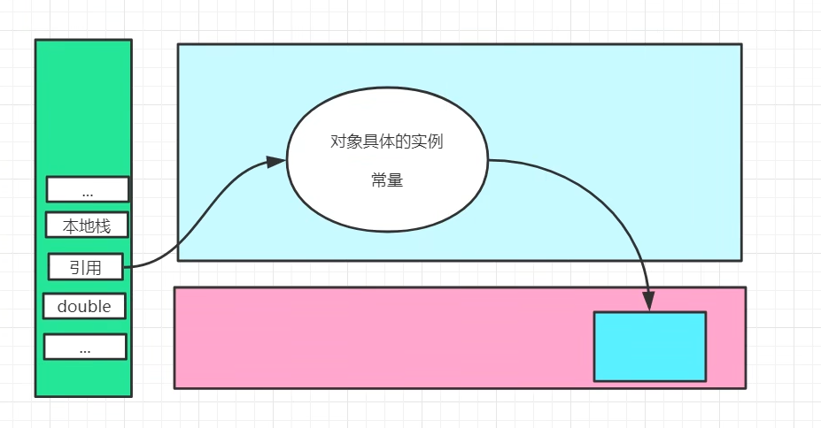

# JVM 探究  
- 请你谈谈对JVM的理解？java8虚拟机和之前的变化更新
- 什么是OOM，什么是栈溢出stackOverflowError?怎么分析？
- JVM的常用调优参数有哪些？
- 内存块照如何抓取，怎么分析Dump文件？知道吗？
- 谈谈JVM中，类加载器你的认识？ 

## JVM的位置



## JVM的体系结构



---

## 类加载器 双亲委派机制



1. 虚拟机自带的加载器
2. 启动类的(根)加载器
3. 扩展类加载器
4. 应用程序加载器

--- 

## 沙箱安全机制
&emsp;&emsp;Java安全模型的核心就是java沙箱(sandbox)，什么是沙箱?沙箱就是一个限制程序运行的环境。沙箱机制就是将java代码限定在虚拟机(JVM)特定的运行范围中，并且严格限制代码对本地系统资源访问，通过这样的措施来保证对代码的有效隔离，防止对本地系统造成破坏。沙箱<strong>主要限制系统资源访问</strong>，那系统资源包括什么？CPU、内存、文件系统、网络。不同级别的沙箱对这些资源访问的限制也可以不一样。  
&emsp;&emsp;所有的java程序运行都可以指定沙箱，可以定制安全策略。  
&emsp;&emsp;在java中将执行程序分成本地代码和远程代码两种，本地代码默认视为可信任的，而远程代码则被看作是不受信的。对于授信的本地代码，可以访问一切本地资源。而对于非授信的远程代码在早期的java实现中，安全依赖于沙箱(Sandbox)机制。如图所示JDK1.0安全模型。  



&emsp;&emsp;但如此严格的安全机制给程序的功能扩展带来了障碍，比如当用户希望远程代码访问本地系统的文件时候，就无法实现。因此在后续的Java 1.1版本中，针对安全机制做了改进，增加了<font color=red>安全策略</font>，允许用户指定代码对本地资源的访问权限，如下图所示JDK1.1安全模型  



&emsp;&emsp;在java1.2版本中，再次该进了安全机制，增加了代码签名。不论本地代码或是远程代码，都会按照用户的安全策略设定，由类加载器加载到虚拟机中权限不同的运行空间，来实现差异化的代码权限控制。如图所示，JDK1.2安全模型  



&emsp;&emsp;JDK1.6的安全机制，则引入了域(Domain)的概念。虚拟机会把所有代码加载到不同的系统域和应用域，系统域部分专门负责与关键资源进行交互，而各个应用域部分则通过系统域的部分代理来对各种需要的资源进行访问。虚拟机中不同的受保护域(Protected Domain)，对应不一样的权限(Permission)。存在于不同域着哦功能的类文件就具有了当前域的全部权限，如下图所示JDK1.6的安全模型  



组成沙箱的基本组件：  
- <strong>字节码校验器</strong>(bytecode verifier)：确保java类文件遵循java语言规范。这样可以帮助Java程序实现内存保护。但并不是所有的类文件都会经过字节码校验，比如核心类。  
- 类装载器(class loader)：其中类装载器在3个方面对Java沙箱起作用  
  - 它防止恶意代码去干涉善意的代码。------双亲委派机制  
  - 它守护了被信任的类库边界。------包名  
  - 它将代码归入保护宇，确定了代码可以进行那些操作。

&emsp;&emsp;虚拟机为不同的类加载器载入的类提供不同的命名空间，命名空间由一系列的名称组成，每一个被装载的类将有一个类的名字，这个命名空间是由Java虚拟机为每一个类装载器维护，它们互相之间甚至不可见。  
&emsp;&emsp;类装载器采用的机制就是双亲委派模式。  

1. 从最内层JVM自带类加载器开始加载，外层恶意同名类得不到加载从而无法使用
2. 由于严格通过包名来区分了访问域，外层恶意同名类通过内置代码也无法获得权限访问到内层类，破坏代码就自然无法生效。  

- <strong>存取控制器</strong>(access controller)：存取控制器可以控制核心API对操作系统的读取权限，而这个控制的策略的设定可以由用户指定。  
- <strong>安全管理器</strong>(security manager)：是核心API和操作系统直觉爱你的主要接口。实现权限控制，比存取控制器优先级高。  
- 安全软件包(Security package)：java.security下的类和扩展包下的类，允许用户为自己的应用增加新的安全特性，包括：  
  - 安全提供者
  - 消息摘要
  - 数字签名 keytools
  - 加密
  - 鉴别

## Native

编写一个多线程启动
```
public static void main(String[] args){
  new Thread(()->{
      }
  ,"zj970").start();
}

```

点进去查看start方法的源码

```
    public synchronized void start() {
        /**
         * This method is not invoked for the main method thread or "system"
         * group threads created/set up by the VM. Any new functionality added
         * to this method in the future may have to also be added to the VM.
         *
         * A zero status value corresponds to state "NEW".
         */
        if (threadStatus != 0)
            throw new IllegalThreadStateException();

        /* Notify the group that this thread is about to be started
         * so that it can be added to the group's list of threads
         * and the group's unstarted count can be decremented. */
        group.add(this);

        boolean started = false;
        try {
            start0();
            started = true;
        } finally {
            try {
                if (!started) {
                    group.threadStartFailed(this);
                }
            } catch (Throwable ignore) {
                /* do nothing. If start0 threw a Throwable then
                  it will be passed up the call stack */
            }
        }
    }

```
- Native Method Stack

&emsp;&emsp;它的具体做法是Native Method Stack 中登记native方法，在（Execution Engine）执行引擎的时候加载Native Libraies。

## PC寄存器

- 程序计数器：Program Counter Register

&emsp;&emsp; 每个线程都有一个程序计数器，是线程私有的，就是一个指针，指向方法中的方法字节码（用来存储指向一条指令的地址，也即将要执行的指令代码），在执行引擎读取下一条制定，是一个非常小的内存空间，几乎可以忽略不计。

## 方法区

- Method Area 方法区

&emsp;&emsp;方法区被所有线程共享，所有字段和方法字节码，以及一些特殊方法，如构造函数，接口代码也在此定义，简单来说，所有定义的方法的信息都保存在该区域，<strong>此区域属于共享空间</strong>  
&emsp;&emsp;<font color=yellow>静态变量、常量、类信息（构造方法、接口定义）、运行时的常量池也存在方法区中，但是实例变量存在堆内存中，和方法区无关</font>

## 栈

- 栈  <font color=blue>先进后出</font>，这就是为什么main方法先执行，最后结束
- 队列 <font color=blue>先进先出</font>

- 栈
1. 栈内存，主管程序的运行，生命周期和线程同步;在Android 中有任务栈活动栈的概念
2. 线程结束，栈内存就是释放，对于栈来说，不存在垃圾回收问题
3. 栈：8大基本类型+对象引用+实例的方法
4. 栈运行的原理：<strong>栈帧</strong>

产生StackOverError:

 

栈+堆+方法区：交互关系  


## 三种JVM
## 堆
## 新生区、老年区
## 永久区
## 堆内存调优
## GC
    1. 常用算法
## JMM
## 总结

- 百度
- 思维导图