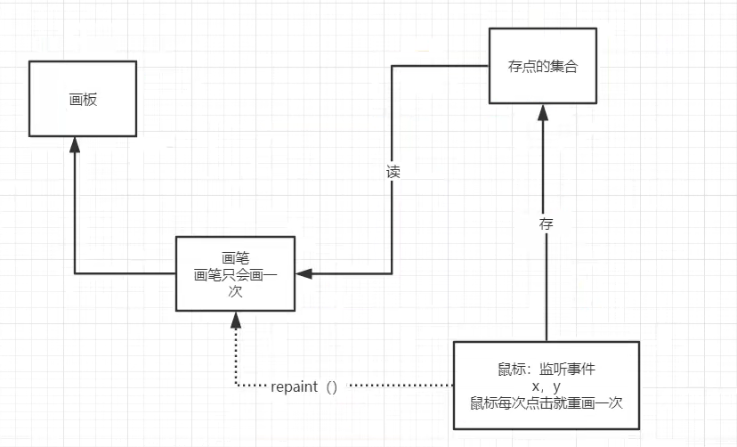
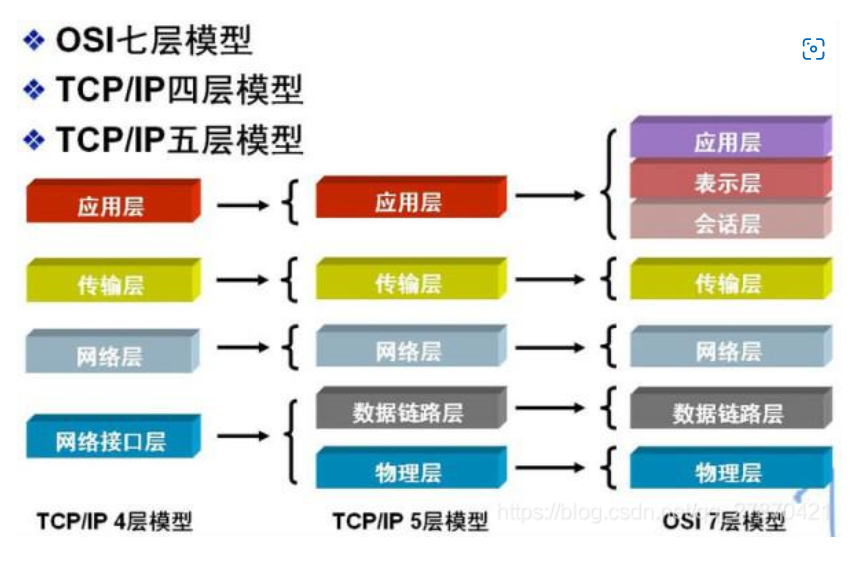
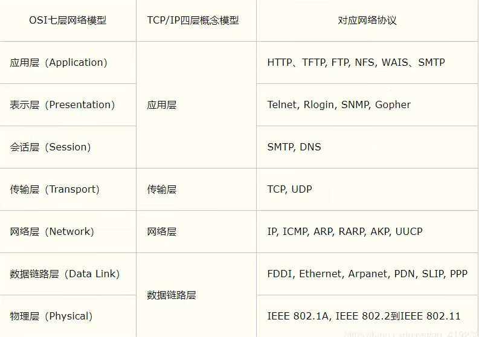
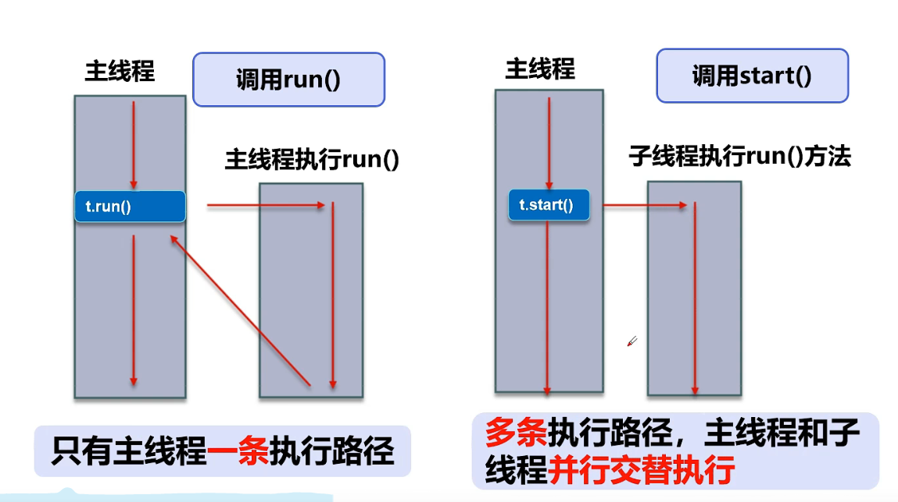
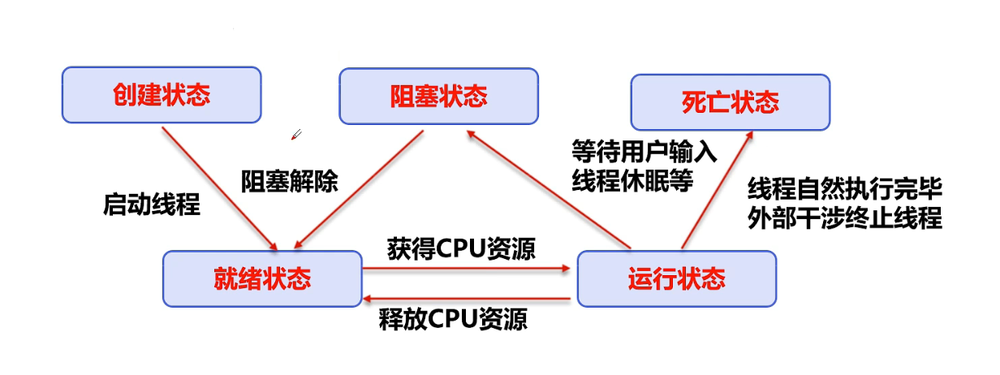
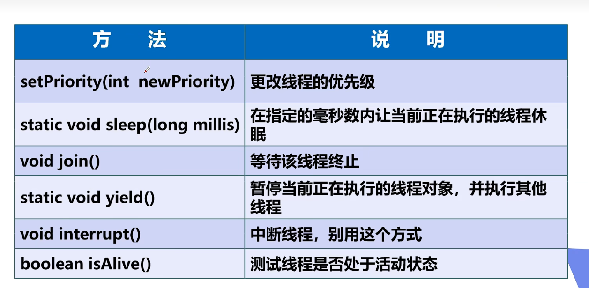
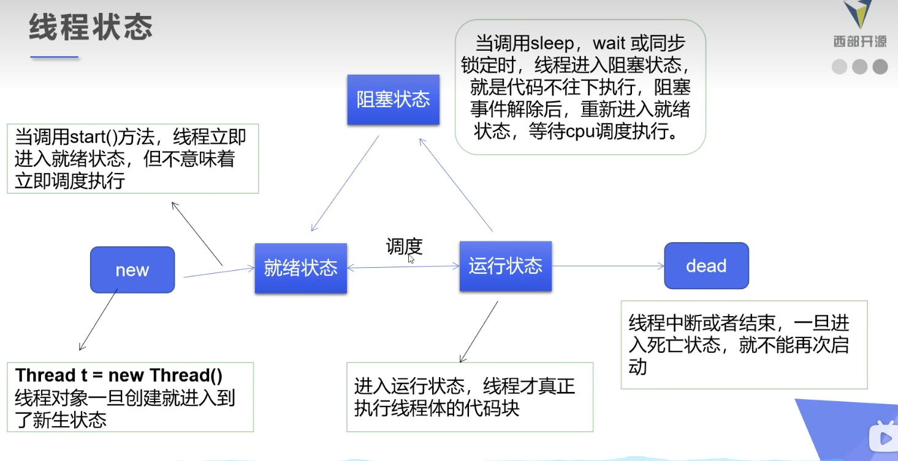

  #  学习准备：博客

- 博客，英文名为Blog,它的正式名称为网络日记
- 为什么要写博客？
  - 需要总结和思考。有时候我们一直在赶路，却忘了放慢脚步
  - 提升文笔组织能力
  - 提升学习总结能力
  - 提升逻辑思维能力
  - 帮助他人，结交朋友
- 冰冻三尺非一日之寒，写博客也是，短期内可能看不到效果，但是长期坚持，对自己的提升很有帮助


# MarkDown语法

## **标题**

==#＋空格== 设置为一级标题

==##+空格== 设置为二级标题

- 几个#代表几级标题，后面加空格，最多六级标题

- 也可以用ctrl+1/2/3/4快捷键设置标题


## 字体

**粗体**

两个**， 文字在中间 

快捷键 ctrl + B


*斜体*

两个*，文字在中间

快捷键，ctrl+i


~~删除线~~

两个~~, 文字在中间

快捷键 Alt+shift+5


<u>下划线</u>

快捷键 ctrl+U


## 引用

> 自信即巅峰

引用  ：开头输入 >


## 分割线

我是分割线

***


---

起始位置：输入3个  ==-==, 或者三个 ==*==


## 图片


插入图片格式 ==英文感叹号! + 中括号[图片名字自定义]+(图片路径)== 可以是本地路径也可以是url路径

也可以 ctrl + C 、ctrl + V 


## 超链接

[点击跳转csdn](https://editor.csdn.net/md/?articleId=113530568)

**格式**：==英文中括号[name]+(超链接地址)== 或者==ctrl+K==

这里在网页里可以直接访问，在typora里面可以通过 ==ctrl+鼠标点击== 打开网站访问


## 列表

***有序列表*** ： 1. 加空格 或者 ==ctrl+shift+[== 二级 ==Tab== 一下

1. A
2. B
3. C

***无序列表***  *加空格 或者 ==ctrl+shift+]== 二级同上

* A
  * a


## 表格

1. ==ctrl+T==
2. 打开==源代码模式==--表头、数据

表头数据：|名字|性别|生日|

表中格式：|:----|:----:|----:|与上面一致，分别是居右，居中，居左

表中数据：|张三|男|1999.02.11|

|名字|性别|生日|
|:----|:----:|----:|
|张三|男|1999.02.11|


## 代码

三个==`==  然后选择语言

```java 
//支持很多语言
public class Hello{
  public static void main(String args[]){
    System.out.printf("Hello world");
  }
}
```


## 流程图

- 三个``` 然后选择flow

- 主要的语法为==name=>type:describe==,其中type主要有以下几种：(==英文冒号后面必须加空格==)

1. 开始和结束：start/end
2. 输入输出: inputoutput
3. 操作: operation
4. 条件: condition
5. 子程序：subroutine

示例：

```flow
st=>start: Start
io=>inputoutput: verification
op=>operation: Your Operation
cond=>condition: Yes or No?
sub=>subroutine: Your subroutine
e=>end: END
st->io->op->cond
cond(yes)->e
cond(no)->sub->io
```

​	

## 高亮

两个==,内容在中间 

参考文献：[markdown文档](https://markdown.com.cn/extended-syntax/tables.html)          [CSDN大佬博客](https://blog.csdn.net/afei__/article/details/80717153?ops_request_misc=&request_id=&biz_id=102&utm_term=makerdown%E8%AF%AD%E6%B3%95&utm_medium=distribute.pc_search_result.none-task-blog-2~all~sobaiduweb~default-2-80717153.pc_search_insert_download&spm=1018.2226.3001.4187)

---

# 什么是计算机？

- **Computer:全称电子计算机，俗称电脑**
- **能够按照程序运行，自动、高速处理海量数据的现代化智能电子设备。**
- **由==硬件==和==软件==所组成**
- **常见的形式有台式计算机、笔记本计算机、大型计算机等**
- **广泛应用在：科学计算，数据处理。自动控制，计算机辅助设计、人工智能、网络等领域**

## 计算机硬件

- 一些物理装置按系统结构的要求构成一个有机整体为计算机软件运行提供物质基础。

- 计算机硬件组成

  - CPU  Memory(内存) Motherboard(主板)
  - 主板 IO设备
  - 内存
  - 电源、主机箱
  - 硬盘
  - 显卡
  - 键盘、鼠标
  - 显示器
  - 等等.....

  ---

  

### 冯.诺依曼体系结构

冯·诺依曼结构也称[普林斯顿结构](https://baike.baidu.com/item/普林斯顿结构/6688362)，是一种将程序指令存储器和数据存储器合并在一起的存储器结构。程序指令存储地址和数据存储地址指向同一个存储器的不同物理位置，因此程序指令和数据的宽度相同，如英特尔公司的8086[中央处理器](https://baike.baidu.com/item/中央处理器/284033)的程序指令和数据都是16[位宽](https://baike.baidu.com/item/位宽/104377)。

数学家[冯·诺依曼](https://baike.baidu.com/item/冯·诺依曼/388909)提出了计算机制造的三个基本原则，即采用二进制逻辑、程序存储执行以及计算机由五个部分组成（[运算器](https://baike.baidu.com/item/运算器/2667320)、[控制器](https://baike.baidu.com/item/控制器/2206126)、[存储器](https://baike.baidu.com/item/存储器/1583185)、[输入设备](https://baike.baidu.com/item/输入设备/10823368)、[输出设备](https://baike.baidu.com/item/输出设备/10823333)），这套理论被称为冯·诺依曼体系结构。


---


## 计算机软件

- 计算机软件可以使计算机按照事先预定好的顺序完成特定的功能
- 计算机软件按照其功能划分为==系统软件==与==应用软件==
- **系统软件**
  - DOS(Disk Operating System), Windows, Linux, Unix, Mac, Android, IOS,鸿蒙....
- **应用软件**
  - WPS 、QQ、微信、英雄联盟、绝地求生....
- 软件、开发。软件开发
- 人机交互（图形化界面，命令行）


## 常用的Dos命令

```bash
#盘符切换 
E:
#创建文件夹
md <name>
#删除文件夹
rd <name>
#删除文件
del <name>
#查看当前目录下的所有文件 
dir
#切换目录 cd 目录地址
cd ..
#清理屏幕 
cls (clear screen)
#退出终端
exit
#查看电脑的ip
ipconfig
/liunx ifconfig
#打开应用
	calc计算机
	mspaint画图
	notepad记事本
	
#Ping 命令
	ping www.baidu.com
	


```


----

## 计算机语言发展史

### 第一代语言

- 计算机的基本计算方式都是基于二级制的方式。
- 二进制：0101 1011 1001 0100 0111 0101 0101 1101 #include <stdio.h>
- 这种代码直接输入给计算机使用，不经过任何的转换

### 第二代语言

- **汇编语言**
  - 解决人类无法读懂机器语言的问题
  - 指令代替二进制
- 目前应用：
  - 逆向工程
  - 机器人
  - 病毒
  - .....

### 第三代语言

- 高级语言
- 大体分为： ==面向过程==和==面向对象==两大类
- C语言使经典的面向过程的语言。C++、JAVA是经典的面向对象的语言。
- 聊聊各种语言：
  - C语言
  - C++
  - JAVA
  - C#
  - Python,PHP,JavaScript
  - .....


----

# JAVA 发展与介绍

## C & C++

- 1972年C诞生
  - 贴近硬件，运行极快，效率极高
  - 操作系统，编译器，数据库，网络系统等
  - 指针和内存管理
- 1982年C++诞生
  - 面向对象
  - 兼容C
  - 图形领域、游戏等

## Java初生

- 1995年的网页简单而粗糙。缺乏互动性
- 图形界面的程序（Applet）
- Bill Gates说：这是至今为止设计最好能的语言


- Java 2标准版(**J2SE**)：去占领桌面
- Java 2移动版(**J2ME**)：去占领手机
- Java 2企业版(**J2EE**)：去占领服务器


- 他们基于Java开发了居多的平台、系统、工具
  - 构建工具:Ant ,Maven, Jekins
  - 应用服务器：Tomcat，Jetty, Jboss, Webshere,weblogic(三高：==高性能 高并发 高可用==)
  - Web开发：Struts, Spring, Hibernate, myBatis
  - 开发工具：Eclipse, Netbean, intellij idea, Jbuilder
  - ....
- 2006: Hadoop (大数据领域)
- 2008: Android (手机端)

## Java特性和优势

- 简单性
- 面向对象
- 可移植性
- 高性能
- 分布式
- 动态性
- 多线程
- 安全性
- 健壮性

---


## java三大版本

- Write Once,Run Anywhere
- JavaSE: 标准版（桌面程序，控制台开发...)
- JavaME:嵌入式开发(手机，小家电....)
- JavaEE:企业级开发(Web端，服务器开发....)


## Java程序运行机制

- 编译性
- 解释性

- 程序运行机制

  

---

# Java基础语法

## 注释、标识符、关键字

### 注释

- ==书写注释是一个非常好的习惯==
- Java中的注释有三种：
  - 单行注释
  - 多行注释
  - 文档注释

---

### 关键字

| abstract   | assert       | boolean   | break      | byte   |
| ---------- | ------------ | --------- | ---------- | ------ |
| case       | catch        | char      | class      | const  |
| continue   | default      | do        | double     | else   |
| enum       | extends      | final     | finally    | float  |
| for        | goto         | if        | implements | import |
| instanceof | int          | interface | long       | native |
| new        | package      | private   | protected  | public |
| return     | strictfp     | short     | static     | supper |
| switch     | synchronized | this      | throw      | throws |
| transient  | try          | void      | volatile   | while  |

==Java 所有的组成部分都需要名字。类名、变量以及方法名都被称为标识符。==

### 标识符注意点

- 所有的标识符的首字符是字母(==A-Z==或者==a-z==),美元符(==$==)、或者下划线(==_==)

- 首字符之后可以是字母(==A-Z==或者==a-z==),美元符(==$==)、下划线(==_==)或者数字的任何字符组合

- 不能使用关键字作为变量名或者方法名

- 标识符是==大小写敏感==的

- 合法标识符举例：age、$salary、_value、__1_value

- 非法标识符举例:123Bc、-salary、#adc

  ```
  public static void main(String[] args){
  	string 王者荣耀 = "最强王者“;
    System.out.println(王者荣耀);
  }
  ```

- 可以使用中文命名，但是一般不建议这样使用，也不建议使用拼音，很low(==C语言中不能以中文命名==)


---


## 数据类型

- 强类型语言
  - 要求变量的使用要严格符合规定，所有变量都必须先定义后才能使用
- 弱类型语言


- **Java的数据类型分为两大类**
  - 基本类型(primitive type)
  - 引用类型(reference type)

  ```mermaid
  graph LR
  A[数据类型]-->B[基本数据类型]
  A--->C[引用数据类型]
  B-->I[数值类型]
  I-->D[整数类型]
  D-->E[byte占1个字节范围-128-127]
  D-->F[short占2个字节范围-32768-32767]
  D-->G[int占4个字节范围-2147483648-2147483647]
  D-->H[long占8个字节范围-9223372036854775808-39223372036854775808]
  B-->J[浮点类型]
  J-->K[float占4个字节8位有效数字]
  J-->L[double占8个字节16位有效数字]
  B-->Q[boolean类型占1位其值只有true和false两个]
  C-->a[类]
  C-->b[接口]
  C-->c[数组]
  ```

  

  

  ---

  

  ## 什么是字节

- 位(bit):**是计算机 ==内部数据== 储存的最小单位，11001100是一个八位二进制数**。
- 字节(byte):**是计算机 ==数据处理== 的基本单位，习惯用大写B来表示。**
- 1B(byte,字节) = 8bit(位)
- 字符：是指计算机中使用的字母、数字、字和符号


- 1bit 表示1位
- 1Byte表示一个字节 1B = 8b.
- 1024B = 1KB
- 1024KB = 1M
- 1024M = 1G 


### 类型转换

- **由于Java是强类型语言，所以要进行有些运算的时候，需要用到类型转换。**
  - 低----------------------------------------------------------------->高
  - byte -> short -> char-> int ->long -> float -> double
- 运算中，不同类型的数据先转换为同一类型，然后进行计算。
- **强制类型转换**
- **自动类型转换**

---

## 变量

- **变量是什么：就是可以变化的量！**

- **Java是一种强类型语言，每个变量都必须声明其类型**

- **Java变量是程序中最基本的存储单元，其要素包括变量名，变量类型和作用域。**

  ```
  type varName [=value]	[{,varName[=value]}];
  //数据类型	变量名 = 值;可以使用逗号隔开来声明多个同类型变量。
  ```

- ***注意事项***：

  1. 每个变量都有类型，类型可以是基本类型，也可以是引用类型。
  2. 变量名必须是合法的标识符。
     1. 变量声明是一条完整的语句，因此每一个声明都必须以分号结束

---


### 变量作用域

- **类变量**
- **实例变量**
- **局部变量**

```
public class Veriable{
  static int allClicks;//类变量，搭配static
  String str = "Hello world";//实例变量
  
  public void method(){
    int i = 1;//局部变量
  }
}

//C语言中，只有局部变量和全局变量
```

---


## 常量

- **常量(Constant)：初始化(initialize)后不能再改变值！不会改变的值。**
- **所谓常量可以理解成一种特殊的变量，它的值被设定后，在程序运行过程中不运行被改变。**

```
final <VariateName> = value;//C语言中用	const
final double PI = 3.14;
```

- **常量名一般使用大写字符**

---

## 变量的命名规范

- ###### **所有变量、方法、类名：见面如意**

- **类成员变量：首字母小写和驼峰原则：monthSalary**

- **局部变量：首字母小写和驼峰原则**

- **常量：大写字母和下划线：MAX_VALUE**

- **类名：首字母大写和驼峰原则：Man,GoodMan**

- **方法名：首字母小写和驼峰原则:run(),runRun()**


---

## 运算符

- **Java语言支持如下运算符**：
  - 算数运算符：+，-，*，/，%，++，--
  - 赋值运算
  - 关系运算符：>, <, <=, ==, != ，instanceof(判断一个对象是否是一个类的实例)
  - 逻辑运算符：&&，||，！
  - 位运算：&，|，^，~，>>，<<，>>>
  - 条件运算符 ? :
  - 扩展赋值运算符：+=，-=，*=，/=

- **优先级 **


---

## 包机制

- **为了更好地组织类，Java提供了包机制，用于区别类名的命名空间**

- **包语句的语法格式为:**

  ```
  package pkg1[.pkg2[.pkg3...]]
  ```

- <font color= red>**一般利用公司域名倒置作为包名**</font>

- **为了能够使用某一个包的成员，我们需要在 Java 程序中明确导入该包。使用"import"语句**

  ```
  import package1[.package2[.package3..]].(classname|*);
  ```

- **包机制本质就是文件夹**


---

## Java DOC

- **java doc 命令是用来生成自己的API文档的**

- **参数信息**

  - @**author 作者名**
  - @**version 版本号**
  - @**since 指明需要最早使用的jdk版本**
  - @**param 参数名**
  - @**throws 异常抛出情况**

- 命令生成文档

  ```
  javadoc -encoding UTF-8 -charset UTF-8 xxx.java
  ```

- IDEA生成文档

  - Tools > Generate JavaDoc Scope
  - 选择项目还是某个文件
  - Output directory : **输出doc文档路径**
  - Locale : **zh_CN**
  - Other command line arguments : **-encoding UTF-8 -charset UTF-8 -windowtitle “文档HTML页面标签的标题” -link http://docs.Oracle.com/javase/8/docs/api**

---


# Java 流程控制


## 用户交互Scanner

####  Scanner对象

- **之前我们学的基本语法中我们并没有实现程序和人的交互，但是Java 给我们提供了这样一个工具类，我们可以获得用户的输入。<font color=red> java.util.Scanner </font>是java 5的新特征，我们可以<font color=red>通过Scanner 类来获取用户的输入</font>**

- **基本语法：**

  ```
  Scanner s  = new Scanner(System.in);
  //凡是属于IO流的类如果不关闭会一直占用资源，要养成好习惯用完就关掉
  s.close();
  ```

- **通过 Scanner 类的 next() 与 nextLine() 方法获取输入的字符串，在读取前我们一般需要使用 hasNext() 与 hasNextLine() 判断是否还有输入的数据。**

- **next():**

  - **一定要读取到有效字符后才可以结束输入**
  - **对输入有效字符之前遇到的空白，next()方法会自动将其去掉。**
  - **只有输入有效字符后才将其后面输入的空白作为分隔符或者结束符。**
  - <font color=red>**next() 不能得到带有空格的字符串**</font>
  
- **nextLine():**

  - **以Enter为结束符，也就是说 nextLIne()方法返回的是输入回车之前的所有字符。**
  - **可以得到空白**

---


## 顺序结构

- **JAVA的基本结构就是顺序结构，除非特别指明，否则就按照顺序一句一句执行。**

- **顺序结构就是最简单的算法结构**

  ```flow
  st=>start: Start
  e=>end: END
  st->e
  ```

- **语句与语句之间，框与框之间是按从上到下的顺序进行的，它是由若干个依次执行的处理步骤组成的，<font color=red>它是任何一个算法都离不开的一种算法结构。</font>**

  

---

## 选择结构

- **if 单选择结构**
- **if 双选择结构**
- **if 多选择结构**
- **switch 多选择结构**


### if单选择结构

- **我们很多时候需要去判断一个东西是否可行，然后我们才会去执行，这样一个过程在程序中用if 语句来表示**

- **语法：**

  ```
  if(布尔表达式){
  	//如果布尔表达式为true将执行的语句
  }
  ```

---

### if双选择结构

- **当需要两个判断的时候，且事件为互斥事件，就需要双选择结构**

- **语法：**

  ```
  if(布尔表达式){
  	//如果布尔表达式的结果为true
  }else{
  	//如果布尔表达式的结果为false
  }
  
  ```


---

### if多选择结构

- 在生活中，存在一件事情拥有多种可能性区段，所需要的选择不只有两个，所以我们需要一个多选择结构来处理问题

- **语法：**

  ```
  if(布尔表达式 1){
  	//如果布尔表达式 1 的值为true 执行的代码
  }else if(布尔表达式 2){
  	//如果布尔表达式 2 的值为true 执行的代码
  }else if(布尔表达式 3){
  	//如果布尔表达式 3 的值为true 执行的代码
  }esle if(布尔表达式 4){
  	//如果布尔表达式 4 的值为true 执行的代码
  }else{
  	//如果以上布尔表达式都不为true执行代码
  }
  ```

  

---

### Switch 多选择结构

- **多选择结构还有一个实现方式就是switch case 语句**

- **switch case 语句判断一个变量与一系列值中某个值受否相等，每个值称为一个分支**

- **语法：**

  ```
  switch(expression){
  	case value :
  		//语句
  		break;//可选
  	case value :
  		//语句
  		break;//可选
  	case value :
  		//语句
  		break;//可选
  	//可以有任意数量的case语句
  	default: //可选
  		//语句
  		break;
  }
  ```

- **switch 语句中的变量类型可以是：**

  - **byte short int char**
  - <font color=yellow>从 Java SE 7开始</font>
  - <font color="#D02090">switch 支持字符串 String 类型了</font>
  - **同时 case 标签必须为字符串常量或者字面量**

---


### 选择结构嵌套使用

- **if 语句和 if 语句之间可以嵌套使用**


---

## 循环结构

- **while 循环**
- **do... while 循环**
- **for 循环**


- **在 Java 5 中引入了一种主要用于数组的增强型 for 循环---foreach**


### while 循环

- **while是最基本的循环，它的结构为:**

  ```while
  while (布尔表达式){
  	//循环内容
  }
  ```

- **只要布尔表达式为true,循环就会一直执行下去。**

- <font color=red>**我们大多数情况是会让循环停止下来的，我们需要一个让表达式失效的方式来结束循环。**</font>

- **少部分情况需要循环一直执行，比如服务器的请求响应监听等。**

- **循环条件一直为true就会造成无限 循环【死循环】，我们正常的业务编程中应该尽量避免死循环。会影响程序性能或者造成程序卡死奔溃！**

- **练习：计算1+2+3+...+100=？ **

  ```
  //方式一
  int sum = 0;
  int i = 1;
  while(i<101){
  	sum+=i;
  	++i;
  }
  //方式二
  Scanner scanner = new Scanner(System.in);
  int startNum = scanner.nextInt();//1
  int endNum = scanner.nextInt();//100
  int sum = (endNum-start)*(endNum+startNum)/2;//99*100/2
  scanner.close();
  
  ```

---


### do...while 循环

- **对于 While 语句而言，如果不满足条件，则不能进入循环。但有时候我们需要即使不满足条件，也至少执行一次。**

- **do...while 循环和 while 循环相似，不同的是，do...while 循环至少执行一次。**

  ```
  do{
  //代码语句
  }while(布尔表达式)
  ```

- **while 和 do-while 的区别：**

  - **while 先判断后执行。do...while 是先执行一次后判断！**
  - **do...while 总是保证循环体会至少被执行一次！**

---


### For 循环

- 虽然所有循环结构都可以用 while 或者 do...while 表示，但 for 循环使一些循环变得更加简单。

- <font color=red >for 循环语句是支持迭代的一种通用结构，是最有效、最灵活的循环结构。</font>

- for 循环执行的次数实在执行之前就确定了。语法格式：

  ```
  for (初始化; 布尔表达式; 更新){
  	//代码语句
  }
  ```

- 练习1 ：计算0到100之间的奇数和偶数的和

  ```
  int sum1 = 0;//偶数和
  int sum2 = 0;//奇数和
  
  
  for (int i = 0,j = -1; i <=100 || j<=100;i+=2，j+=2){
  	sum1 += i;
  	sum2 += j;
  }
  
  
  ```

- 练习2： 用 while 或for 循环输出1-1000之间能被5整除的数，并且每行输出3个

  ```
  int j = 0;
  for(int i = 0; i <= 1000; i++){
  	if(i%5==0){
  		j++;
  		System.out.print(i+"\t");
  		if(j==3){
  			j = 0;
  			System.out.println();
  		}
  	}
  }
  ```

  

- 练习3：打印九九乘法表

  ```
  for (int i = 1; i < 10; i++){
  	for (int j = 1; j <=i ; j++){
  		System.out.print(j+"X"+i+"="+i*j+"\t");
  	}
  	System.out.println();
  }
  ```

   

---

### 增强For循环

- Java 5 引入了一种主要用于数组或集合的增强型 for 循环

- 语法格式如下：

  ```
  for(声明语句 : 表达式){
  	//代码句子
  }
  ```

- 声明语句：声明新的局部变量，该变量的类型必须和数组元素的类型匹配。其作用域限定在循环语句块中，其值与此时数组元素的值相等

- 表达式：表达式是要访问的数组名，或者是返回值为数组的方法。


---

## Break continue

- **break 在任何循环语句的主体部分，均可用  break 控制循环的流程。<font color=red>break 用于强行退出循环，不执行循环中剩余的语句</font>。（break 语句也在switch 语句中使用）**
- **continue 语句用在循环语句体中，<font color=red>用于终止某次循环过程</font>，即跳出循环体尚未执行的语句，接着进行下一次是否执行循环的判定。**
- **关于 goto 关键字**
  - **goto 关键字很早就在程序设计语言中出现。尽管goto仍是 Java的一个保留字，但并未在语言中得到正式使用；Java没有goto。然而，在 break 和 continue 这两个关键字的身上，我们仍然能看出一些goto的影子---带标签的break和continue**
  - **“标签”是指后面跟一个冒号的标识符，例如：label：**
  - **对 Java来说唯一用到标签的地方就是在循环语句之前。而在循环之前设置标签的唯一理由是：我们希望在其中嵌套另一个循环，由于break和continue关键字通常只中断到存在标签的地方。**

---


# Java 方法


## 什么是方法

**<font size=6px>何谓方法?</font>**

- **System.out.println()，那么它是什么？**


- **Java 方法是语句的集合，它们在一起执行一个功能。**
  - **方法是解决一类问题的步骤的有序组合**
  - **方法包含于类或对象中**
  - **方法在程序中被创建，在其他地方被引用**


- **设计方法的原则：方法的本意就是功能块，就是实现某个功能的语句块的集合。我们设计方法的时候，最好保持方法的原子性，<font color=red>就是一个方法只完成1个功能，这样利于我们后期的扩展</font>**
- <font color=red>回顾: 方法的命名规则？</font>**驼峰命名法**

---


## 方法的定义

- **Java的方法类似于其他语言的函数，是一段<font color=red>用来完成特定功能的代码片段</font>，一般情况下，定义一个方法包含以下语法：**
- **<font color=red>方法包含一个方法头和一个方法体。</font>下面是一个方法的所有部分：**
  - **修饰符：**修饰符，这是可选的，告诉编译器如何调用该方法。定义了该方法的访问类型。
  - **返回值类型：**方法可能会有返回值。return ValueType 是方法返回值的数据类型。有些方法执行所需的操作，但没有返回值。在这种情况下，returnValueType 是关键字 void.
  - **方法名：**是方法的实际名称。方法名和参数表共同构成方法签名。
  - **参数类型：**参数像是一个占位符。当方法被调用的时候，传递值给参数。这个值被称为实参或变量。参数列表是指方法的参数类型、顺序和参数的个数。参数是可选的，方法可以不包含任何参数。
    - **形式参数：**在方法被调用的时候用于接收外界输入的数据。
    - **实参：**调用方法时实际传递给方法的数据。
  - **方法体：**方法体包含具体逻辑语句，定义该方法的功能。

```
修饰符 返回值类型 方法名（参数类型 参数名，参数类型 参数名......）{
	...
	方法体
	...
	return 返回值;
}
```

---


## 方法调用

- **调用方法：对象名.方法名（实参列表）**

- **Java 支持两种调用方法的方式，根据方法是否返回值来选择。**

- **当方法返回一个值的时候，方法调用通常被当作一个值。例如：**

  ```
  int larger = max(30,40);
  ```

- **如果方法返回值是 void ，方法调用一定是一条语句。**

  ```
  System.out.println("Hello world !");
  ```

- **值传递 和 引用传递**

  - 值传递：<font color=red>实参传递给形参的是值  形参和实参在内存上是两个独立的变量 对形参做任何修改不会影响实参</font>
  - 引用传递：<font color=red>实参传递给形参的是参数对于 堆内存上的引用地址 实参和 形参在内存上指向 了同一块区域  对形参的修改会影响实参</font>

---


## 方法重载

- **重载就是在一个类中，有相同的函数名称，但形参不同的函数。**
- **方法重载的规则**
  - 方法名称必须相同
  - 参数列表必须不同（个数不同，或类型不同、参数排列顺序不同等）
  - 方法的返回类型可以相同也可以不相同。
  - 仅仅返回类型不同不足以成为方法的重载。
- **实现理论**：
  - 方法名称相同时，编译器会根据调用方法的参数个数、参数类型等去逐个匹配，以选择对应的方法，如果匹配失败，则编译器报错。


**命令行传参**

- 有时候希望运行一个程序时候再传递给他消息。这是靠传递命令行参数给main()函数实现。

```java
public class CommandLine{
  public static void main(String[] args){
    for(int i = 0; i  < args.length; i++){
      System.out.println("args["+i+"]:"+args[i]);
    }
  }
}
```

---


## 可变参数


- **JDK 1.5 开始，Java 支持传递同类型的可变参数给一个方法。**
- **在方法声明中，在指定参数类型后加一个省略号(...)**
- **一个方法中<font color=yellow>只能指定一个可变参数，他必须是方法的最后一个参数</font>。任何普通的参数必须在它之前声明。**

```java
public class Demo04(){
  public static void printMax(double...numbers){
    if(numbers.length == 0){
        System.out.println("No argument passed");
    	return ;
    }
			double result = numbers[0];
    
    //排序
    for (int i = 1; i < numbers.length; i++){
      if	(numbers[i] > result){
        result = numbers[i];
      }
    }
    System.out.ptrintln("The max value is :" + result);
  }
}
```


----


## 递归

- **A方法调用B方法，我们很容易理解！**
- **递归就是：<font color=red>A方法调用A方法！就是自己调用自己</font>**
- **利用递归可以用简单的程序来解决一些复杂的问题。它通常把一个大型复杂的问题层层转化为一个与原问题相似的规模较小的问题来求解，递归策略只需要少量的程序就可描述出解题过程所需要的多次重复计算，大大地减少了程序的代码量。递归的能力在于用有限的语句来定义对象的无限集合。**
- **递归结构包括两部分：**
  - **递归头：**什么时候不调用自身方法。如果没有头，将陷入 死循环。
  - **递归体：**什么时候需要调用自身方法。


作业：

​	写一个计算器，要求实现加减乘除功能，并且能够循环接受新的数据，通过用户交互实现。

​	

​	思路推荐：

- 写4个方法：加减乘除
- 利用循环 + switch 进行用户交互
- 传递需要操作的两个数
- 输出结果


----

# Java 数组

## 数组的定义

- **数组是相同类型数据的有序集合**
- **数组描述的是相同类型的若干个数据，按照一定的先后次序排列组合而成。**
- **其中，每一个数据称作一个数组元素，每个数组元素可以通过一个下标来访问它们**

---

## 数组声明创建

- **首先必须声明数组变量，才能在程序中使用数组。下面是声明数组变量的语法：**

```
dataType[] arrayRefVar; //首先方法
//或
dataType arrayRefVar[];//效果相同
//以上只是声明，并不像C一样直接可以申请空间
```

- Java语言使用<font color=red>new</font>操作符来创建数组，语法声明如下：

```
dataType[] arrayRefVer = new dataType[arraySize];
```

- **数组的元素是通过索引访问，数组索引从0开始。**
- **获取数组的长度：**<font color=red>arrays.length</font>


---

## 数组的四个基本特点

- **其长度是确定，数组一旦被创建，它的大小就是不可以改变的。**
- **其元素必须是相同类型，不允许出现混合类型。**
- **数组中的元素可以是任何数据类型，包括基本类型和引用类型。**
- **数组变量属引用类型，数组也可以看成是对象，数组中的而每一个元素相当于该对像的成员变量。数组本身就是对象，Java中对象是在堆中的，因此数组无论保存原始类型还是其它对象类型，<font color=green>数组对象本身是在堆中</font>**

## Java内存


---

## 数组的三种初始化

**静态初始化**

```
    int[] a = {1,2,3};
    Man[] mans = {new Man(1,1),new Man(2,2)};
```  
 
**动态初始化**

```
    int[] a = new int[2];
    a[0] = 1;
    a[1] = 2;
```
   
**数组的默认初始化**

:smiley:**数组是引用类型，它的元素相当于类的实力变量，因此数组一经分配空间，其中的每个元素也被按照实例变量同样的方式被隐式初始化。**


---

## 多维数组

- **多维数组可以看成是数组的数组，比如二维数组就是一个特殊的一维数组，其每一个元素都是一个一维数组**

- **二维数组的声明**

```
int a[][] = new int[2][5];
```


---

---

## 数组边界

1.下标的合法区间[0,length-1]，如果越界就会报错；

    public static void main(String[] args){
        int[] a = new int[2];
        System.out.println(a[2]);
    }


2.<font color=red>ArrayIndexOutOfBoundsException:数组下标越界异常！！</font>

3.小结：

**数组是相同数据类型（数据类型可以为任意类型）的有序集合**

**数组也是对象。数组元素相当于对象的成员变量**

**数组的长度是确定的，不可变的。如果越界，则报：ArrayIndexOutofBounds**

## 数组的使用

- ** For-Each 循环**
- **数组作方法入参**
- **数组作返回值**

## Arrays 类

- 数组的工具类 java.util.Arrays

- 由于数组对象本身并没有什么方法可以供我们调用，但API中提供了一个工具类Arrays供我们使用，从而可以对数据对像进行一些基本的操作。

- <font color=red>**查看JDK帮助文档**</font>

- Arrays 类的方法都是 static 修饰的静态方法，在使用的时候可以直接使用类名进行调用，而“不用”使用对象来调用（注意：是“不用”而不是“不能”）

- 具有以下常用功能:

  - 给数组赋值：通过 fill 方法。

  - 对数组排序：通过 sort 方法，按升序。

  - 比较数组：通过 equals 方法比较数组中元素是否相等。

  - 查找数组元素：通过 binarySearch 方法能对排序好的数组进行二分查找法操作。

---

# 冒泡排序

- 冒泡排序无疑是最为出名的排序算法之一，总共有八大排序！


- 冒泡的代码非常简单，两层循环，外层冒泡轮数，里层比较，江湖中人人尽皆知。

- 我们看到嵌套循环，应该立马就可以得出这个算法的时间复杂度为 O(n^2)。

- 思考：如何优化？

- 拓展

  - 稀疏数组

  - 需求：编写五子棋游戏中，有存盘退出和续上盘的功能

  - 分析问题：因为该二维数组的很多值是默认值0，因此记录了很多没有意义的数据。

  - 解决：稀疏数组


参考文档：
[竹雨听闲-博客园-数据结构常见的八大排序](https://upload-images.jianshu.io/upload_images/1156494-fef2b2e3edc03289.gif)


# 稀疏数组

- 定义

当一个数组（包括多维数组）中的大部分元素为0或者为同一个数值的数组时，为了节约空间起到压缩的效果，将数据用另一种结构来表示，即**稀疏数组**。

- 实现

1. 遍历二维数组，得出有效数据的个数 sum 。

2. 根据有效数据的个数，确定稀疏数组 sparseArr[sum+1][3] 。

3. 遍历二维数组，给稀疏数组赋值。

## 稀疏数组介绍

- 当一个数组中大部分元素为0，或者为同一一值的数组时，可以使用稀疏数组来保存该数组。

- 稀疏数组的处理方式：

  - 记录数组一共有几行几列，有多少个不同值

  - 把具有不同值的元素和行列及值记录在一个小规模的数组里，从而缩小程序的规模。

- 如下图：左边是原始数组，右边是稀疏数组。


---

# Java 面向对象

## 1.初识面向对象

### 面向过程 & 面向对象

- **面向过程思想**

  - 步骤清晰简单，第一步做什么，第二步做什么......

  - 面向过程适合处理一些简单的问题

- **面向对象思想**

  - 物以类聚，<font color = red>分类</font>的思维模式，思考问题首先会解决问题需要哪些分类，然后对这些分裂进行单独思考。最后，才对某个分类下的细节进行面向过程的思索。

  - 面向对象适合处理复杂的问题，适合处理需要多人协作的问题！

- **<font color=red>对于描述复杂的事物，为了从宏观上把握，从整体上合理分析，我们需要使用面向对象的思路来分析整个系统，但是，具体到微观操作，仍然需要面向过程的思路去处理。</font>**

## 什么是面向对象

- 面向对象编程(Object-Oriented Programming,OOP)

- 面向对象编程的本质是：<font color=red>以类的方式组织代码，以对象的组织(封装)数据</font>

- 抽象

- 三大特性

  -**封装**

  -**继承**

  -**多态**

- **从认识论角度考虑是先有对象后有类。对象，是具体的事物。类，是抽象的。是对对象的抽象。**

- **从代码运行角度考虑是先有类后有对象。类是对象的模板。**
---

## 2.方法回顾和加深

- 方法的定义

  - 修饰符

  - 返回类型

  - break 和 return 的区别

  - 方法名

  - 参数列表

  - 异常抛出

- 方法的调用

  - 静态方法

  - 非静态方法

  - 形参和实参

  - 值传递和引用传递

  - this 关键字

---
---

## 3.对象的创建分析

### 类和对象的关系

- **类是一种抽象的数据类型，它是对某一类事物整体描述/定义，但是并不能代表某一个具体的事物。**

  - 动物、植物、手机、电脑......
  - Person 类、Pet 类、Cat 类等，这些类都是用来描述/定义某一类具体的事物应该具有的特点和行为

- **对象是抽象概念的具体实例**

  - 张三就是人的一个具体实例，张三家里的旺财就是狗的一个具体实例。

  - 能够体现出特点，展现出功能的具体的实例，而不是一个抽象的概念。

### 创建与初始化对象

- **使用 new 关键字创建对象**

- 使用 new 关键字创建的时候，除了分配内存空间外，还会给创建好的对象进行默认的初始化以及对类中构造器的调用。

- 类中的构造器也称为构造方法，是在进行创建对象的时候必须调用的。并且构造器有以下两个特点：

  - 必须和类名相同

  - 必须没有返回类型，也不能写成 void

- **构造器必须掌握**    
  

---

## 4.面向对像三大特性

### 封装

- 该露的露，该藏的藏

  - 我们程序设计要追求"<font color=red>高内聚，低耦合</font>”。高内聚就是类的内部数据操作细节自己完成，不允许外部干涉；低耦合就是仅暴露少量的方法给外部使用。

- 封装（数据的隐藏）

  - 通常，应将禁止直接访问一个对象只能给数据的实际表示，而应通过操作接口来访问，这称为信息隐藏。

记住这句话：<font color = red> 属性私有， get/set</font>

作用：

* 1.提高程序的安全性，保护数据
* 2.隐藏代码的实现细节
* 3.统一接口
* 4.系统可维护增加

### 继承

- 继承的本质是对某一批类的抽象，从而实现对现实世界更好的建模。

-  <font color = red> extands </font>的意思是“扩展”。子类是父类的扩展。

- JAVA中类只有单继承，没有多继承！

- 继承是类和类之间的一种关系。除此之外，类和类之间的关系还有依赖、组合、聚合等。

- **继承关系的两个类，一个为子类（派生类），一个为父类（基类）。子类继承父类，使用关键字extends来表示。**

- 子类和父类之间，从意义上讲应该具有"is a"的关系

- object 类

- super

  - 1.super 调用父类的构造方法，必须在构方法的第一个

  - 2.super 必须只能出现子类的方法或者构造方法中

  - 3.super 和 this 不能同事调用构造方法！

  VS this :

  代表的对象不同：

        this: 本身调用者这个对象
    
        super: 代表父类对象的应用

  前提：

        this ： 没有继承也可以使用
        
        super : 只能在继承条件才能使用

  构造方法：

        this(): 本类的构造
        
        super(): 父类的构造


- 方法重写

重写：需要有继承关系，子类重写父类的方法！

1. 方法名必须相同

2. 参数列表必须相同

3. 修饰符：范围可以扩大但不能缩小： public > protected > Default > private

4. 抛出的异常： 范围，可以被缩小，但不能扩大：ClassNOtFoundException --> Exception(大)

重写，子类的方法和父类必须一致，方法体不同！

为什么需要重写：

1. 父类的功能，子类不一定需要，或者不一定满足！

快捷键： Alt + insert : override;


### 多态

- 动态编译：增加可扩展性

- 即同一方法可以根据发送对象的不同而采用多种不同的行为方式。

- 一个对象的实际类型是确定的，但可以指向对象的引用的类型有很多

- 多态存在的条件

  - 有继承关系

  - 子类重写父类方法

  - 父类引用指向子类对象

- 注意：多态是方法的多态，属性没有多态性

- instanceof

1. 使用父类类型的引用指向子（孙）类的对象

2. 该引用只能调用父类定义的方法和变量

3. 如果子类中重写了父类的一个方法，那么调用这个方法的时候，将会调用子类中的方法。


多态注意事项：

1. 多态是方法的多态，属性没有多态

2. 父类和子类有联系，才能引用 类型转换异常 ClassCastException

3. 存在条件：继承关系，方法需要重写，父类引用指向子类对象！（子类是父类的多种形态之一，父类可以化身子类）

4. static 方法，属于类，它不属于实例； final 常量； private 方法


---

## 5.抽象类和接口

### 抽象类

- <font color = red>abstract</font>修饰符可以用来修饰方法也可以修饰类，如果修饰方法，那么该方法就是抽象方法；如果修饰类，那么该类就是抽象类

- 抽象类中可以没有抽象方法，但是有抽象方法的类一定要声明为抽象类。

- 抽象方法，只有方法的声明，没有方法的实现，它是用来让子类实现的。

- 子类继承抽象类，那么就必须实现冲现象类没有实现的抽象方法，否则该子类也要声明为抽象类。

抽象类就是来实现封装，多态的增强、代码的可扩展性

### 接口

- 普通类：只有具体实现

- 抽象类：具体实现和规范（抽象方法）都有！

- 接口：只有规范！（没有具体实现）

- 接口就是规范，定义的石一组规则，体现了显示世界中“如果你是...则必须能...”的思想。如果你是天使你，则必须能非，如果是汽车，则必须能跑。

- 接口的本质是契约，就像我们人间的法律一样。指定好后大家都遵守。

- OO的精髓，是对对此昂的抽象，最能体现这一点的就是接口。为什么我们讨论设计模式都只针对具备了抽象能力的语言（比如C++、java、C#等），就是因为设计模式所研究的，实际上就是如何合理去抽象。

- <font color = red>声明类的关键字是 class ,声明接口的关键字是 interface </font>


---

## 6.内部类及OOP实战

### 内部类

- 内部类就是在一个类的内部在定义一个类，比如，A类中定义一个B类，那么B类相对A类来说就称为内部类，而A类相对B类来说就是内部类了。

1. 成员内部类

2. 静态内部类

3. 局部内部类

4. 匿名内部类


# Java 异常机制

## 什么是异常

- 实际工作中，遇到的情况不可能是非常完美的。比如：你写的某个模块，用户输入不一定符合你的要求，你的程序要打开某个文件，这个文件可能不存在捉着文件格式不对，你要读取数据库的数据，数据可能是空的等。我们的程序在跑着，内存或硬盘可能满了。等等。

- 软件程序在运行过程中，非常可能遇到刚刚提到的这些异常问题，我们叫异常，英文是： Exception,意思是例外。这些例外情况，或者叫异常，怎么让我们写的程序做出合理的处理，而不至于程序崩溃。

- 异常指程序运行中出现的不期而至的各种状况，如：文件找不到、网络链接失败、非法参数等。

- 异常发生在程序运行期间，它影响了正常的程序执行流程。

### 简单分类

- 要理解Java异常处理是如何工作的，你需要掌握以下三种类型的异常：

1. 检查性异常：最具有代表的检查性异常是用户错误或问题引起的异常，这是程序无法预料的。例如要打开一个不存在文件时，一个异常就发生了，这些异常在编译时不能被简单地忽略。

2. 运行时异常：运行时异常时可能被程序猿避免的异常。与检查性异常相反，运行时异常可以在编译时被忽略。

3. 错误：错误不是异常，而是脱离程序猿控制的问题。错误在代码中通常被忽略。例如，当栈溢出时，一个错误就发生了，他们在编译也检查不到的。

## 异常体系结构

- Java 把异常当作对象来处理，并定义一个基类 java.lang.Throwable 作为所有异常的超类。

- 在 java API 中一经定义了许多异常类，这些异常类分为两大类，错误Error和异常Exception.


### Error

- Error类对象由Java虚拟机生成并抛出，大多数错误与代码编写者所执行的操作无关。

- Java 虚拟机运行错误(VirtualMachineError)，当JVM不再有继续执行操作所需的内存资源时，将出现OutOfMemoryError。这些异常发生时，Java虚拟机(JVM)一般会选择线程终止;

- 还有发生在虚拟机试图执行应用时，如类定义错误(NoClassDefFoundError)、链接错误(LinkageError)。这些错误是不可查的，因为它们在应用程序的控制和处理能力之外，而且绝大多数是程序运行时不允许出现的状况。

### Exception

- 在Exception分支中有一个重要的子类RurtimeException(运行时异常)

  - ArraylndexOutOfBoundsException(数组下标越界)

  - NullPointerException(空指针异常)

  - ArithmeticException(算术异常)

  - MissingResourceException(丢失资源)

  - ClassNotFoundException(找不到类）等异常，这些异常是不检查异常，程序中可以选择捕获处理，也可以不处理。

- 这些异常一般是由程序逻辑错误引起的，程序应该从逻辑角度尽可能避免这类异常的发生;

- Error和Exception的区别:
  - Error 通常是灾难性的致命的错误,是程序无法控制和处理的，当出现这些异常时，Java虚拟机(JVM)一般会选择终止线程;
  - Exception 通常情况下是可以被程序处理的，并且在程序中应该尽可能的去处理这些异常。

## java 异常处理机制

- 抛出异常

- 捕获异常

- 异常处理五个关键字

  - try 监控区域

  - catch(想要捕获的异常类型)捕获异常Throwable 最高级

  - finally 处理善后工作

  - throw 主动抛出异常，用在方法中  throw new ArithmeticException();

  - throws 方法的定义上使用 throws 表示这个方法可能抛出某种异常

throw 和 throws 的区别？

参考文章：[throw 和 throws 的区别](https://blog.csdn.net/meism5/article/details/90414147#:~:text=throw%E5%92%8Cthrows%20%E7%9A%84%E8%AF%A6%E7%BB%86%20%E5%8C%BA%E5%88%AB%20%E5%A6%82%E4%B8%8B%EF%BC%9A%20throw%20%E6%98%AF%E8%AF%AD%E5%8F%A5%E6%8A%9B%E5%87%BA%E4%B8%80%E4%B8%AA%E5%BC%82%E5%B8%B8%E3%80%82,%E8%AF%AD%E6%B3%95%EF%BC%9A%20throw%20%28%E5%BC%82%E5%B8%B8%E5%AF%B9%E8%B1%A1%29%3B%20throw%20e%3B%20throws%20%E6%98%AF%E6%96%B9%E6%B3%95%E5%8F%AF%E8%83%BD%E6%8A%9B%E5%87%BA%E5%BC%82%E5%B8%B8%E7%9A%84%E5%A3%B0%E6%98%8E%E3%80%82)

## 自定义异常

- 使用Java内置的异常类可以描述在编程是出现的大部分异常情况。除此之外，用户还可以自定义异常。用户自定义异常类，只需要继承 Exception 类即可。

- 在程序中使用自定义异常类，大体可分为以下几个步骤：

1. 创建自定义异常类。

2. 在方法中通过 throw 关键字抛出异常对象。

3. 如果在当前抛出异常的方法中处理异常，可以使用 try-catch 语句捕获异常并处理；否则在方法的声明处通过 throws 关键字知名要抛出给方法调用者的异常，继续进行下一步操作。

4. 在出现异常方法的调用者中捕获并处理异常。

## 总结

- 处理运行时异常时，采用逻辑去合理规避同事辅助 try-catch 处理

- 在多重 catch 块后面，可以加一个 catch （Exception）来处理可能会被遗漏的异常

- 对于不确定的代码，也可以加上 try-catch ，处理潜在的异常

- 尽量去处理异，切记只是简单地调用 printStackTrace() 去打印输出

- 具体如何处理异常，要根据不同的业务需求和异常类型去决定

- 尽量添加 finally 语句块去释放占用的资源。

# GUI编程

怎么学？
- 这是什么？
- 它怎么玩？
- 该如何去在我们平时运用？

组件
- 窗口
- 弹窗
- 面板
- 文本框
- 列表框
- 按钮
- 图片
- 监听事件
- 鼠标事件
- 键盘事件

外挂：Java

## 简介

---

GUI的核心技术： Swing AWT

1. 因为界面不美观
2. 需要jre环境

为什么我们要学习？
1. 可以写出自己心中想要的一些小工具
2. 工作的时候，也可能需要维护到swing界面，概率极小！
3. 了解MVC架构，了解监听！

## AWT

---
#### AWT介绍

1. 包含了很多类和接口！GUI:
2. 元素：窗口、按钮、文本框
3. java.awt


#### 组件和容器

1. Frame
```java
package com.zj.lesson1;

import java.awt.*;

//GUI的第一个界面
public class TestFrame {

    public static void main(String[] args) {
        //Frame
        Frame frame = new Frame("我的第一个java图像窗口");

        //需要设置可见性
        frame.setVisible(true);

        //设置窗口大小
        frame.setSize(400,400);

        //设置背景颜色
        frame.setBackground(new Color(72, 187, 32));

        //弹出的初始位置
        frame.setLocation(200,200);

        //设置大小固定
        frame.setResizable(false);
    }
}
//出现问题：无法关闭窗口,只能停止程序
```

2. 面板Panel

解决了窗口无法关闭的问题，
出现问题：效果未像狂老师那样

原因：如果不主动设置layout(布局管理器），默认是BorderLayout,
frame.add(contentPane);这条语句默认情况下将contentPane放在了BorderLayout.CENTER位置，且frame上没有其它的组件，因此contentPane覆盖了frame的全部区域。
```java
package com.zj.lesson1;

import java.awt.*;
import java.awt.event.WindowAdapter;
import java.awt.event.WindowEvent;
import java.awt.event.WindowListener;

//Panel 可以看成是一个空间，但是不能单独存在
public class TestPanel {
    public static void main(String[] args) {
        Frame frame = new Frame();

        //布局的概念
        Panel panel = new Panel();
        Panel panel1 = new Panel();


        //设置布局
        frame.setLayout(null);

        //坐标
        frame.setBounds(300,0,1000,1000);
        frame.setBackground(new Color(40,161,35));

        //panel设置坐标，相对于frame
        panel.setBounds(100,50,200,200);
        panel.setBackground(new Color(193,15,60));

        //panel设置坐标，相对于frame
        panel1.setBounds(500,350,200,200);
        panel1.setBackground(new Color(15, 27, 193));

        //frame.add（panel）
        frame.add(panel);
        frame.add(panel1);
        frame.setVisible(true);

        //监听事件，监听窗口关闭事件 System.exit(0);
        //适配器模式
        frame.addWindowListener(new WindowListener() {
            @Override
            public void windowOpened(WindowEvent e) {

            }

            @Override
            public void windowClosing(WindowEvent e) {

            }

            @Override
            public void windowClosed(WindowEvent e) {

            }

            @Override
            public void windowIconified(WindowEvent e) {

            }

            @Override
            public void windowDeiconified(WindowEvent e) {

            }

            @Override
            public void windowActivated(WindowEvent e) {

            }

            @Override
            public void windowDeactivated(WindowEvent e) {

            }
        });
        frame.addWindowListener(new WindowAdapter() {
            //窗口点击关闭时的事件
            @Override
            public void windowClosing(WindowEvent e) {
                super.windowClosing(e);
                System.exit(0);
            }
        });
    }
}

```

3. 布局管理器

- 流式布局

```java
package com.zj.lesson1;

import java.awt.*;
import java.awt.event.WindowAdapter;
import java.awt.event.WindowEvent;

public class TestFlowLayout {
    public static void main(String[] args) {
        Frame frame = new Frame();

        //组件-按钮
        Button button1 = new Button("button1");
        Button button2 = new Button("button2");
        Button button3 = new Button("button3");

        //设置为流式布局
        //frame.setLayout(new FlowLayout());
        frame.setLayout(new FlowLayout(FlowLayout.LEFT));

        frame.setSize(500,500);
        //把按钮添加上去
        frame.add(button1);
        frame.add(button2);
        frame.add(button3);

        frame.setVisible(true);

        frame.addWindowListener(new WindowAdapter() {
            @Override
            public void windowClosing(WindowEvent e) {
                super.windowClosing(e);
                System.exit(0);
            }
        });


    }
}

```

- 东西南北中


```java
package com.zj.lesson1;

import java.awt.*;
import java.awt.event.WindowAdapter;
import java.awt.event.WindowEvent;

public class TestBorderLayout {
    public static void main(String[] args) {
        Frame frame = new Frame();

        Button east = new Button("East");
        Button west = new Button("West");
        Button south = new Button("South");
        Button north = new Button("North");
        Button center = new Button("Center");

        frame.add(east,BorderLayout.EAST);
        frame.add(west,BorderLayout.WEST);
        frame.add(south,BorderLayout.SOUTH);
        frame.add(north,BorderLayout.NORTH);
        frame.add(center,BorderLayout.CENTER);

        frame.setSize(500,500);

        frame.setVisible(true);

        frame.addWindowListener(new WindowAdapter() {
            @Override
            public void windowClosing(WindowEvent e) {
                super.windowClosing(e);
                System.exit(0);
            }
        });
    }
}

```


- 表格布局 Grid

```java
package com.zj.lesson1;

import java.awt.*;
import java.awt.event.WindowAdapter;
import java.awt.event.WindowEvent;

public class TestGridLayout {
    public static void main(String[] args) {

        Frame frame = new Frame("TestGridLayout");

        Button btn1 = new Button("btn1");
        Button btn2 = new Button("btn2");
        Button btn3 = new Button("btn3");
        Button btn4 = new Button("btn4");
        Button btn5 = new Button("btn5");
        Button btn6 = new Button("btn6");

        frame.setLayout(new GridLayout(3, 2));
        frame.add(btn1);
        frame.add(btn2);
        frame.add(btn3);
        frame.add(btn4);
        frame.add(btn5);
        frame.add(btn6);

        frame.pack();//java 的函数 自动选择最优的布局,自动填充，不需要设置大小
        frame.setVisible(true);

        frame.addWindowListener(new WindowAdapter() {
            @Override
            public void windowClosing(WindowEvent e) {
                super.windowClosing(e);
                System.exit(0);
            }
        });
    }
}


```


4. 大小，定位，背景颜色，可见性，监听

#### 布局管理器

```java

package com.zj.practice;

import java.awt.*;
import java.awt.event.WindowAdapter;
import java.awt.event.WindowEvent;

//联系frame,panel,button，布局
public class Exdemo01 {
  public static void main(String[] args) {
    //总frame
    Frame frame = new Frame("练习题");
    frame.setSize(400, 300);
    frame.setLocation(300, 400);
    frame.setBackground(Color.BLACK);
    frame.setVisible(true);
    frame.setLayout(new GridLayout(2, 1));

    //4个面板
    Panel panel1 = new Panel(new BorderLayout());
    Panel panel2 = new Panel(new GridLayout(2, 1));
    Panel panel3 = new Panel(new BorderLayout());
    Panel panel4 = new Panel(new GridLayout(2, 2));

    //上面
    panel1.add(new Button("East-1"), BorderLayout.EAST);
    panel1.add(new Button("West-1"), BorderLayout.WEST);
    panel2.add(new Button("p2-btn-1"));
    panel2.add(new Button("p2-btn-2"));
    panel1.add(panel2, BorderLayout.CENTER);

    //下面
    panel3.add(new Button("East-2"), BorderLayout.EAST);
    panel3.add(new Button("West-2"), BorderLayout.WEST);
    for (int i = 0; i < 4; i++) {
      panel4.add(new Button("for-" + i));
    }
    panel3.add(panel4);
    frame.add(panel1);
    frame.add(panel3);
    frame.addWindowListener(new WindowAdapter() {
      @Override
      public void windowClosing(WindowEvent e) {
        super.windowClosing(e);
        System.exit(0);
      }
    });
  }
}
```


总结：
1. Frame是一个顶级窗口
2. Panel无法单独显示，必须添加到某个容器中
3. 布局管理器
   1. 流式
   2. 东西南北中
   3. 表格
4. 大小、定位、背景颜色、可见性、监听


#### 事件监听

事件监听：当某个事件发生的时候，干什么。

```java
package com.zj.lesson2;

import java.awt.*;
import java.awt.event.ActionEvent;
import java.awt.event.ActionListener;
import java.awt.event.WindowAdapter;
import java.awt.event.WindowEvent;

public class TestActionEvent {
    public static void main(String[] args) {
        //按下按钮，出发一些事件
        Frame frame = new Frame();
        Button button = new Button();

        //因为addActionListener()需要一个ActionListener,所以我们需要构造一个ActionListener
        MyActionListener myActionListener = new MyActionListener();
        button.addActionListener(myActionListener);

        frame.add(button,BorderLayout.CENTER);
        frame.pack();
        frame.setVisible(true);

        windowClose(frame);
    }

    public static void windowClose(Frame frame){
        frame.addWindowListener(new WindowAdapter() {
            @Override
            public void windowClosing(WindowEvent e) {
                super.windowClosing(e);
                System.exit(0);
            }
        });
    }
}

//事件监听
class MyActionListener implements ActionListener{
    @Override
    public void actionPerformed(ActionEvent e) {
        System.out.println("aaa");
    }
}
```

多个按钮，共享一个事件实现

```java
package com.zj.lesson2;

import javax.swing.*;
import java.awt.*;
import java.awt.event.ActionEvent;
import java.awt.event.ActionListener;

public class TestActionTwo {
    public static void main(String[] args) {
        //两个按钮，实现同一个监听
        //开始 停止

        Frame frame = new Frame("开始-停止");
        Button button1 = new Button("start");
        Button button2 = new Button("stop");

        //可以显示的定义触发返回的命令，如果不设置，就显示默认的值（标签）
        button2.setActionCommand("button2-stop");

        MyMonitor myMonitor = new MyMonitor();
        button1.addActionListener(myMonitor);
        button2.addActionListener(myMonitor);

        frame.add(button1,BorderLayout.NORTH);
        frame.add(button2,BorderLayout.SOUTH);
        frame.setVisible(true);
    }
}

class MyMonitor implements ActionListener{
    @Override
    public void actionPerformed(ActionEvent e) {

        //e.getActionCommand()获得按钮的信息
        System.out.println("按钮被点击了：msg"+e.getActionCommand());

        if (e.getActionCommand().equals("start")){
            System.out.println("你点击了开始按钮");
        }
        else if (e.getActionCommand().equals("button2-stop")){
            System.out.println("点击了退出按钮");
            System.exit(0);
        }
    }
}
```


#### 输入框TextField监听

```java
package com.zj.lesson2;

import java.awt.*;
import java.awt.event.ActionEvent;
import java.awt.event.ActionListener;

public class TestTextField {
    public static void main(String[] args) {
        //服务器应该只有一个启动类
        new MyFrame();
    }
}
class MyFrame extends Frame{
    public MyFrame(){
        TextField textField = new TextField();
        add(textField);
        //监听这个文本框输入的文字
        MyActionLictener myActionLictener = new MyActionLictener();
        //按下Enter就会触发这个事件
        textField.addActionListener(myActionLictener);
        //设置替换编码
        textField.setEchoChar('*');
        setVisible(true);
        pack();
    }
}
class MyActionLictener implements ActionListener{
    @Override
    public void actionPerformed(ActionEvent e) {
        e.getSource();//获得一些资源

        TextField field = (TextField) e.getSource();
        System.out.println(field.getText());//获得文本框输入的文本
        //每次输入清空
        field.setText("");//null.""
    }
}
```
#### 简易计算器，组合+内部类回顾复习

oop原则：组合大于继承
```java
class A extends B{
    
}

class A{
    public B b;//组合
}
```
目前代码：

```java
package com.zj.practice;

import java.awt.*;
import java.awt.event.ActionEvent;
import java.awt.event.ActionListener;

//简易计算器
public class TestCalc {
    public static void main(String[] args) {

        new Calcuator();
    }
}
//计算器类
class Calcuator extends Frame{
    public Calcuator(){
        //三个文本框
        TextField textField1 = new TextField(10);//字符数
        TextField textField2 = new TextField(10);
        TextField textField3 = new TextField(20);
        //1 个按钮
        Button button = new Button("=");
        button.addActionListener(new MyCalculatorListener(textField1,textField2,textField3));
        //1个标签
        Label label = new Label("+");

        //布局
        setLayout(new FlowLayout());//流式布局

        add(textField1);
        add(label);
        add(textField2);
        add(button);
        add(textField3);

        pack();;
        setVisible(true);
    }
}
//监听器类
class MyCalculatorListener implements ActionListener{
    //获取三个变量
    private TextField num1,num2,num3;

    public MyCalculatorListener(TextField num1,TextField num2,TextField num3){
        this.num1 = num1;
        this.num2 = num2;
        this.num3 = num3;
    }

    @Override
    public void actionPerformed(ActionEvent e) {

        //1.获得加数和被加数
        int n1 = Integer.parseInt(num1.getText());
        int n2 = Integer.parseInt(num2.getText());

        //2.将结果放在第三个框
        num3.setText(""+(n1+n2));

        //3.消除前面两个框
        num1.setText("");
        num2.setText("");
    }
}
```
改造为面向对象的程序

```java
package com.zj.practice;

import java.awt.*;
import java.awt.event.ActionEvent;
import java.awt.event.ActionListener;

//简易计算器
public class TestCalc {
    public static void main(String[] args) {

        new Calcuator().LoadFrame();
    }
}
//计算器类
class Calcuator extends Frame{

    //三个文本框
    TextField textField1 = new TextField(10);//字符数
    TextField textField2 = new TextField(10);
    TextField textField3 = new TextField(20);

    public void LoadFrame(){

        //1 个按钮
        Button button = new Button("=");
        button.addActionListener(new MyCalculatorListener(this));
        //1个标签
        Label label = new Label("+");

        //布局
        setLayout(new FlowLayout());//流式布局

        add(textField1);
        add(label);
        add(textField2);
        add(button);
        add(textField3);

        pack();;
        setVisible(true);
    }

}
//监听器类
class MyCalculatorListener implements ActionListener{
    //直接操作对象
    private Calcuator calcuator = null;

    public MyCalculatorListener(Calcuator calcuator){
        this.calcuator = calcuator;
    }

    @Override
    public void actionPerformed(ActionEvent e) {

        //1.获得加数和被加数
        int n1 = Integer.parseInt(calcuator.textField1.getText());
        int n2 = Integer.parseInt(calcuator.textField2.getText());

        //2.将结果放在第三个框
        calcuator.textField3.setText(""+(n1+n2));

        //3.消除前面两个框
        calcuator.textField1.setText("");
        calcuator.textField2.setText("");
    }
}
```

内部类实现---内部类的最大好处就是畅通无阻地访问外部类的属性方法
```java
package com.zj.practice;

import java.awt.*;
import java.awt.event.ActionEvent;
import java.awt.event.ActionListener;

//简易计算器
public class TestCalc {
    public static void main(String[] args) {

        new Calcuator().LoadFrame();
    }
}
//计算器类
class Calcuator extends Frame{

    //三个文本框
    TextField textField1 = new TextField(10);//字符数
    TextField textField2 = new TextField(10);
    TextField textField3 = new TextField(20);

    public void LoadFrame(){

        //1 个按钮
        Button button = new Button("=");
        button.addActionListener(new MyCalculatorListener());
        //1个标签
        Label label = new Label("+");

        //布局
        setLayout(new FlowLayout());//流式布局

        add(textField1);
        add(label);
        add(textField2);
        add(button);
        add(textField3);

        pack();;
        setVisible(true);
    }
    //监听器类
    private class MyCalculatorListener implements ActionListener{

        @Override
        public void actionPerformed(ActionEvent e) {

            //1.获得加数和被加数
            int n1 = Integer.parseInt(textField1.getText());
            int n2 = Integer.parseInt(textField2.getText());

            //2.将结果放在第三个框
            textField3.setText(""+(n1+n2));

            //3.消除前面两个框
            textField1.setText("");
            textField2.setText("");
        }
    }
}
```

#### 画笔

````java
package com.zj.lesson2;

import java.awt.*;
import java.awt.event.ActionEvent;
import java.awt.event.ActionListener;
import java.awt.event.WindowAdapter;
import java.awt.event.WindowEvent;

public class TestActionEvent {
    public static void main(String[] args) {
        //按下按钮，出发一些事件
        Frame frame = new Frame();
        Button button = new Button();

        //因为addActionListener()需要一个ActionListener,所以我们需要构造一个ActionListener
        MyActionListener myActionListener = new MyActionListener();
        button.addActionListener(myActionListener);

        frame.add(button,BorderLayout.CENTER);
        frame.pack();
        frame.setVisible(true);

        windowClose(frame);
    }

    public static void windowClose(Frame frame){
        frame.addWindowListener(new WindowAdapter() {
            @Override
            public void windowClosing(WindowEvent e) {
                super.windowClosing(e);
                System.exit(0);
            }
        });
    }
}

//事件监听
class MyActionListener implements ActionListener{
    @Override
    public void actionPerformed(ActionEvent e) {
        System.out.println("aaa");
    }
}

````
####  鼠标监听

```java
package com.zj.lesson3;

import java.awt.*;
import java.awt.event.MouseAdapter;
import java.awt.event.MouseEvent;
import java.util.ArrayList;
import java.util.Iterator;

//鼠标监听事件
public class TestMouseListener {
    public static void main(String[] args) {
        new MyFrame("画画");
    }
}

//自己的类
class MyFrame extends Frame{
    //画画需要画笔，需要监听鼠标当前位置，需要集合来存储这个点
    ArrayList points;
    public MyFrame(String title) {
        super(title);
        setBounds(200, 200, 400, 400);

        //存鼠标点击点
        points = new ArrayList<>();

        //鼠标监听器，正对这个窗口
        this.addMouseListener(new MyMouseListener());

        setVisible(true);
    }
        @Override
        public void paint(Graphics g) {
            //画画，监听鼠标的事件
            Iterator iterator = points.iterator();
            while (iterator.hasNext()){
                Point point = (Point) iterator.next();
                g.setColor(Color.cyan);
                g.fillOval(point.x,point.y,10,10);
            }
        }
        //添加一个点到界面上去
        public void addPaint(Point point){
            points.add(point);
        }


        //适配器模式
        private class MyMouseListener extends MouseAdapter{
            //鼠标按下不放

            @Override
            public void mousePressed(MouseEvent e) {
                MyFrame myFreame = (MyFrame) e.getSource();
               //TODO :这里我们点击的时候，就会在界面产生一个点
                // 这个点就是鼠标的点
                myFreame.addPaint(new Point(e.getX(),e.getY()));
                //每次点击鼠标都需要重新画一遍
                myFreame.repaint();
            }
        }

}
```

#### 窗口监听
```java

class WindowFrame extends Frame {
    public WindowFrame(){
        setBackground(Color.blue);
        setBounds(100,100,200,200);
        setVisible(true);
        addWindowListener(new MyWindowListener());
    }
    class MyWindowListener extends WindowAdapter{
        @Override
        public void windowClosing(WindowEvent e) {
            setVisible(false);//隐藏窗口，通过按钮
            System.exit(0);
        }
    }
}
```
优化
```java
class WindowFrame extends Frame {
    public WindowFrame(){
        setBackground(Color.blue);
        setBounds(100,100,200,200);
        setVisible(true);
        addWindowListener(new WindowAdapter() {
            @Override
            public void windowClosing(WindowEvent e) {
                setVisible(false);//隐藏窗口，通过按钮
                System.exit(0);
            }
        });
    }
}
```

#### 键盘监听

```java
package com.zj.lesson3;

import java.awt.*;
import java.awt.event.KeyAdapter;
import java.awt.event.KeyEvent;

//键
public class TestKeyListener {
    public static void main(String[] args) {
        new KeyFrame();
    }
}

class KeyFrame extends Frame {
    public KeyFrame(){
        setBounds(1,2,300,400);
        setVisible(true);
        this.addKeyListener(new KeyAdapter() {
            @Override
            public void keyPressed(KeyEvent e) {
                //键盘按下
                //不需要去记录这个数值，直接使用静态属性VK_XXX
                System.out.println(e.getKeyCode());
                if (e.getKeyCode()==KeyEvent.VK_UP)
                {
                    System.out.println("你按下了上键");
                }
                //根据按下不同操作，产生不同结果
            }
        });
    }

}

```

## Swing

### 窗口、面板

```java
package com.zj.lesson4;

import javax.swing.*;

public class JFrameDemo {
    //init();初始化
    public void init(){
        //顶级窗口
        JFrame jframe = new JFrame("这是一个JFrame窗口");
        jframe.setVisible(true);
        jframe.setBounds(100,100,200,200);

        //设置文字 Jlabel
        JLabel jLabel = new JLabel("hello,world");
        jframe.add(jLabel);

        //关闭事件
        jframe.setDefaultCloseOperation(WindowConstants.EXIT_ON_CLOSE);
    }
    public static void main(String[] args) {
        new JFrameDemo().init();
    }
}

```

标签居中
```java
package com.zj.lesson4;

import javax.swing.*;
import java.awt.*;

public class JFrameDemo02 {
    public static void main(String[] args) {
        new MyJframe2().init();
    }
}
class MyJframe2 extends JFrame{
    public void init(){
        this.setBounds(10,10,200,200);
        this.setVisible(true);
        //设置文字 Jlabel
        JLabel jLabel = new JLabel("hello,world");
        this.add(jLabel);
        //让文本居中
        jLabel.setHorizontalAlignment(SwingConstants.CENTER);

        //获得一个容器
        Container contentPane = this.getContentPane();
        contentPane.setBackground(Color.BLUE);
    }
}

```
### 弹窗

弹窗默认就有退出不需要this.setDefaultCloseOperation(WindowConstants.EXIT_ON_CLOSE);
```java
package com.zj.lesson4;

import javax.swing.*;
import java.awt.*;
import java.awt.event.ActionEvent;
import java.awt.event.ActionListener;

//主窗口
public class DialogDemo  extends JFrame {
    public DialogDemo(){
        this.setVisible(true);
        this.setSize(700,500);
        this.setDefaultCloseOperation(WindowConstants.EXIT_ON_CLOSE);

        //JFrame 放东西，容器
        Container container = this.getContentPane();
        //绝对布局
        container.setLayout(null);
        //按钮
        JButton button = new JButton("点击弹出一个对话框");//创建
        button.setBounds(30,30,200,50);
        container.add(button);
        //点击这个按钮的时候，弹出一个弹窗
        button.addActionListener(new ActionListener() {//监听器
            @Override
            public void actionPerformed(ActionEvent e) {
                //弹窗
                new MyDialogDemo();
            }
        });
    }
    public static void main(String[] args){
        new DialogDemo();
    }
}
//弹窗的窗口
class MyDialogDemo extends JDialog{
    public MyDialogDemo() {
        this.setVisible(true);
        this.setBounds(100,100,500,500);
        //this.setDefaultCloseOperation(WindowConstants.EXIT_ON_CLOSE);
        Container container = this.getContentPane();
        container.setLayout(null);
        JLabel label = new JLabel("学习java真开心");
        label.setBounds(50,50,100,100);
        container.add(label);
    }
}
```
### 标签
label
```
new label("xxx")

```

### 面板
JPanel

```java
package com.zj.lesson5;

import javax.swing.*;
import java.awt.*;

public class JPanelDemo extends JFrame {

    public JPanelDemo(){
        Container container = this.getContentPane();
        container.setLayout(new GridLayout(2,1,10,10));//后面参数的意思就是间距

        JPanel jPanel = new JPanel(new GridLayout(1,3));
        JPanel jPanel1 = new JPanel(new GridLayout(2,1));
        JPanel jPanel2 = new JPanel(new GridLayout(2,3));
        JPanel jPanel3 = new JPanel(new GridLayout(1,1));
        jPanel.add(new JButton("1"));
        jPanel.add(new JButton("1"));
        jPanel.add(new JButton("1"));
        jPanel1.add(new JButton("2"));
        jPanel1.add(new JButton("2"));
        jPanel2.add(new JButton("3"));
        jPanel2.add(new JButton("3"));
        jPanel2.add(new JButton("3"));
        jPanel2.add(new JButton("3"));
        jPanel2.add(new JButton("3"));
        jPanel2.add(new JButton("3"));
        jPanel3.add(new JButton("4"));
        this.setVisible(true);
        //this.setBounds(50,50,400,400);
        container.add(jPanel);
        container.add(jPanel1);
        container.add(jPanel2);
        container.add(jPanel3);
        this.setSize(500,500);
        this.setDefaultCloseOperation(WindowConstants.EXIT_ON_CLOSE);

    }

    public static void main(String[] args) {
        new JPanelDemo();
    }
}

```
滚动条 JScrollPanel
```java
package com.zj.lesson5;

import javax.swing.*;
import java.awt.*;

public class JScrollDemo extends JFrame {
    public JScrollDemo() {
        Container container = this.getContentPane();
        //文本域
        JTextArea textArea = new JTextArea(20,50);
        textArea.setText("Hello World");
        JScrollPane jScrollPane = new JScrollPane(textArea);
        container.add(jScrollPane);

        this.setVisible(true);
        this.setBounds(100,100,300,600);
        this.setDefaultCloseOperation(WindowConstants.EXIT_ON_CLOSE);
    }

    public static void main(String[] args) {
        new JScrollDemo();
    }
}

```

### 按钮

图片按钮

```java
package com.zj.lesson5;
import javax.swing.*;
import java.awt.*;
import java.net.URL;

public class JButtonDemo01 extends JFrame {
    public JButtonDemo01(){
        Container container = this.getContentPane();
        //将图片变成图标
        URL resource = JButtonDemo01.class.getResource("tx.jpg");//这里报异常，重启一下IDEA
        //URL url = ImageIconTest.class.getResource("tx.jpg");
        Icon icon = new ImageIcon(resource);
        //把这个图标放在按钮上
        JButton button = new JButton();
        button.setIcon(icon);
        button.setToolTipText("图片按钮");
        //add
        container.add(button);
        this.setVisible(true);
        this.setSize(500,300);
        this.setDefaultCloseOperation(WindowConstants.EXIT_ON_CLOSE);
    }
    public static void main(String[] args) {
        new JButtonDemo01();
    }
}

```

- 单选按钮

```java
package com.zj.lesson5;

import javax.swing.*;
import java.awt.*;
import java.net.URL;
public class JButtonDemo02 extends JFrame {
    public JButtonDemo02(){
        Container container = this.getContentPane();
        //将图片变成图标
        URL resource = JButtonDemo02.class.getResource("tx.jpg");//这里报异常，重启一下IDEA
        //URL url = ImageIconTest.class.getResource("tx.jpg");
        Icon icon = new ImageIcon(resource);
        //弄一个单选框
        JRadioButton jRadioButton1 = new JRadioButton("jRadioButton1");
        JRadioButton jRadioButton2 = new JRadioButton("jRadioButton2");
        JRadioButton jRadioButton3 = new JRadioButton("jRadioButton3");

        //单选框只能选择一个，分组,不分组可以多选
        ButtonGroup buttonGroup = new ButtonGroup();
        buttonGroup.add(jRadioButton1);
        buttonGroup.add(jRadioButton2);
        buttonGroup.add(jRadioButton3);
        //add
        container.add(jRadioButton1,BorderLayout.CENTER);
        container.add(jRadioButton2,BorderLayout.NORTH);
        container.add(jRadioButton3,BorderLayout.SOUTH);
        this.setVisible(true);
        this.setSize(500,300);
        this.setDefaultCloseOperation(WindowConstants.EXIT_ON_CLOSE);
    }
    public static void main(String[] args) {
        new JButtonDemo02();
    }
}

```

- 复选按钮
```java
package com.zj.lesson5;

import javax.swing.*;
import java.awt.*;
import java.net.URL;

public class JButtonDemo03 extends JFrame {
    public JButtonDemo03() {
        Container container = this.getContentPane();
        //将图片变成图标
        URL resource = JButtonDemo02.class.getResource("tx.jpg");//这里报异常，重启一下IDEA
        //URL url = ImageIconTest.class.getResource("tx.jpg");
        Icon icon = new ImageIcon(resource);
        //弄一个多选框
        JCheckBox jCheckBox1 = new JCheckBox("jCheckBox1");
        JCheckBox jCheckBox2 = new JCheckBox("jCheckBox2");
        JCheckBox jCheckBox3 = new JCheckBox("jCheckBox3");

        container.add(jCheckBox1,BorderLayout.CENTER);
        container.add(jCheckBox2,BorderLayout.NORTH);
        container.add(jCheckBox3,BorderLayout.SOUTH);
        this.setVisible(true);
        this.setSize(500, 300);
        this.setDefaultCloseOperation(WindowConstants.EXIT_ON_CLOSE);
    }

    public static void main(String[] args) {
        new JButtonDemo03();
    }
}

```
### 列表
- 下拉框

```java
package com.zj.lesson6;

import javax.swing.*;
import java.awt.*;

public class TestComboboxDemo01 extends JFrame {
    public TestComboboxDemo01(){
        Container container = new Container();
        JComboBox status = new JComboBox();
        status.addItem(null);//项数为-1
        status.addItem("正在上映");//为0
        status.addItem("已下架");
        status.addItem("即将上映");
        status.setSize(200,200);
        status.setBackground(Color.black);
        status.setVisible(true);
        //监听
        //status.addActionListener();
        //status.addItemListener();
        System.out.println(status.getSelectedIndex());//返回项数
        System.out.println(status.getSelectedItem());//返回内容
        container.add(status,BorderLayout.CENTER);
        this.add(container);
        this.setSize(500,350);
        this.setVisible(true);
        status.setVisible(true);
        this.setDefaultCloseOperation(WindowConstants.EXIT_ON_CLOSE);
    }
    public static void main(String[] args) {
        new TestComboboxDemo01();
    }
}

```

- 列表框

```java
package com.zj.lesson6;

import javax.swing.*;
import java.awt.*;
import java.util.Vector;

public class TestComboboxDemo02 extends JFrame {
    public TestComboboxDemo02(){
        Container container = new Container();
        //生成列表的内容
        String[] contents = {"1","2","3"};
        //列表中需要放内容
        JList jList = new JList(contents);
        //Vector vector = new Vector();
        //JList jList1 = new JList(vector);
        //vector.add("1");
        //vector.add("12");
        //vector.add("13");
        container.add(jList);
        //container.add(jList1);
        container.setVisible(true);
        this.add(jList);
        this.setSize(500,350);
        this.setVisible(true);
        this.setDefaultCloseOperation(WindowConstants.EXIT_ON_CLOSE);
    }
    public static void main(String[] args) {
        new TestComboboxDemo02();
    }
}

```

- 应用场景

  - 选择地区，或者一些单个选项
  - 列表，展示信息，一般是动态扩容
### 文本框
  

- 文本框

```java
package com.zj.lesson6;

import javax.swing.*;
import java.awt.*;

//文本框
public class TestTextDemo01 extends JFrame
{
    public TestTextDemo01() throws HeadlessException {
        Container container = this.getContentPane();


        JTextField jTextField = new JTextField("hello");
        JTextField jTextField2 = new JTextField("world",20);
        container.add(jTextField,BorderLayout.NORTH);
        container.add(jTextField2,BorderLayout.SOUTH);
        this.setSize(500,350);
        this.setVisible(true);
        this.setDefaultCloseOperation(WindowConstants.EXIT_ON_CLOSE);
    }

    public static void main(String[] args) {
        new TestTextDemo01();
    }
}

```

- 密码框

```java
package com.zj.lesson6;

import javax.swing.*;
import java.awt.*;
//密码框
public class TestTextDemo02 extends JFrame {
    public TestTextDemo02() throws HeadlessException {
        Container container = this.getContentPane();

        //面板制作，不用
        JPasswordField jTextField = new JPasswordField();//***
        jTextField.setEchoChar('*');
        container.add(jTextField,BorderLayout.NORTH);
        this.setSize(500,350);
        this.setVisible(true);
        this.setDefaultCloseOperation(WindowConstants.EXIT_ON_CLOSE);
    }

    public static void main(String[] args) {
        new TestTextDemo02();
    }
}

```

- 文本域

```java
package com.zj.lesson6;

import com.zj.lesson5.JScrollDemo;

import javax.swing.*;
import java.awt.*;

//文本域
public class TestTextDemo03 extends JFrame {
    public TestTextDemo03() throws HeadlessException {
        Container container = this.getContentPane();
        //文本域
        JTextArea jTextArea = new JTextArea(20,50);
        jTextArea.setText("好好学习，天天向上");

        //Scroll面板
        JScrollPane scrollPane = new JScrollPane(jTextArea);
        container.add(scrollPane);
        this.setSize(500,350);
        this.setVisible(true);
        this.setDefaultCloseOperation(WindowConstants.EXIT_ON_CLOSE);
    }

    public static void main(String[] args) {
        new TestTextDemo03();
    }
}
```

# 贪吃蛇

帧，如果时间足够小，就是动画，一秒30帧 60帧。连起来就是动画，拆开就是静态的图片。

键盘监听

定时器 Timer

1. 定义数据
2. 画上去
3. 监听事件
  - 键盘
  - 事件

---

# 网络编程

## 概述

- 计算机网络

计算机网络是指将地理位置的具有独立功能的多台计算机机器外部设别，童话或通信线路连接起来，在啊网络操作系统、网络管理软件及网络通信协议的管理和协调下，实现资源共享和信息传递的计算机系统。


- 网络编程的目的：

无限电台...传播交流信息，数据交换、通信

**想要达到这个效果需要什么：**

1. 如何准确的定位网络上的一台主机 192.168.16.124：端口，定位到这个计算机上的莫格资源
2. 找到了这个主机，如何传输数据呢？

javaWeb： 网页编程 B/S
网络编程： TCP/IP C/S
网络通信的要素
---
##如何实现网络的通信？

** 通信双方地址：**

- ip地址
- 端口号
- 192.168.124：59000

**规则：网络通信协议**
TCP/IP参考模型




小结：

1. 网络编程中有两个主要的问题
   1. 如何准确地定位到网络上的一台或者多台主机
   2. 找到主机之后如何进行通信
2. 网络编程的要素
   1. IP和端口号
   2. 网络通信协议 udp,tcp
3. 万物皆对象


## ip

ip地址：InetAddress

- 唯一定位一台网络计算机
- 127.0.0.1 localhost
- ip地址的分类
  - ip地址分类
  - ipv4/ipv6
    - IPV4 127.0.0.1,4个字节组成，0~255,数量约42亿；30亿在北美，亚洲4亿。2011年就用尽；
    - IPV6 240e:3b2:32df:7c10::556，128位。8个无符号整数
  
    ```2001:0bb2:aaaa:0005:0000:0000:1aaa:1312```
  - 公网（互联网）-私网（局域网）
    - ABCD类地址
- 域名：记忆IP问题
  - IP: www.jd.com

## 端口

端口表示计算机上的一个程序的进程；

- 不同的进程有不同的端口号！用来区分软件！
- 被规定0~65535
  - TCP，UDP: 65535 * 2 tcp:80,udp:80,单个协议，端口号不能冲突
    - 端口分类
      - 公有端口 0~1023
        - HTTP: 80
        - HTTPS: 443
        - FTP: 21 (文本传输协议)
        - Telent: 23
      - 程序注册端口：1024~49151,分配用户或者程序
        - Tomcat : 8080
        - MySQL : 3306
        - Oracle : 1521
      - 动态、私有：49152~65535
      ```
      DOC: netstat -ano # 查看所有的端口
      netstat -ano | findstr "5900" # 查询指定的端口
      tasklist | findstr "8696" 查询指定端口的进程
      ```
## 通信协议
协议：约定，就好比我们现在说的是普通话。

**网络通信协议**:速率、传输码率、代码结构、传输控制.....

**问题：** 非常的复杂

大事化小：分层

**TCP/IP协议簇:实际上是一组协议**

重要：
  - TCP: 用户传输协议
  - UDP: 用户数据报协议

出名协议
  - TCP
  - IP :网络互连协议

TCP UDP 对比

TCP ：打电话

- 连接，稳定
- 三次握手 四次挥手
```
最少需要三次，保证稳定连接！
A: 你瞅啥？
B: 瞅你咋地
A: 干一场！

A: 我要走了
B: 我真的要走了吗？
B: 你真的真的要走了吗？
A: 我真的要走了！
B:
```
- 客户端、服务器
- 传输完成，释放连接、效率低

UDP ： 发短信

- 不连接，不稳定
- 客户端、服务器端：没有明确的界限
- 不管有没有准备好，都可以发给你.....
- 导弹
- DDOS :洪水攻击！（饱和攻击）


## TCP

---

客户端

1. 连接服务器Socket
2. 发送消息

```java
package com.zj.lesson02;

import java.io.IOException;
import java.io.OutputStream;
import java.net.InetAddress;
import java.net.Socket;
import java.net.UnknownHostException;
import java.nio.charset.StandardCharsets;

//客户端
public class TcpClientDemo01 {
    public static void main(String[] args) {
        Socket socket = null;
        OutputStream outputStream = null;
        //1. 要知道服务器地址
        try {
            InetAddress serverIP = InetAddress.getByName("127.0.0.1");
            //2.端口号
            int port = 9999;
            //3.创建一个socket连接
            socket = new Socket(serverIP, port);
            //4.发送消息IO流
            outputStream = socket.getOutputStream();
            outputStream.write("你好，服务器".getBytes());
        } catch (Exception e) {
            e.printStackTrace();
        } finally {
            if (outputStream != null) {
                try {
                    outputStream.close();
                } catch (IOException e) {
                    e.printStackTrace();
                }
            }
            if (socket != null) {
                try {
                    socket.close();
                } catch (IOException e) {
                    e.printStackTrace();
                }
            }
        }
    }

}

```

服务器

1. 建立服务的端口 ServerSocket
2. 等待用户的链接 accept
3. 接收用的信息

```java
package com.zj.lesson02;

import java.io.ByteArrayInputStream;
import java.io.ByteArrayOutputStream;
import java.io.IOException;
import java.io.InputStream;
import java.net.ServerSocket;
import java.net.Socket;

//服务器
public class TcpServerDemo01 {
    public static void main(String[] args) {
        ServerSocket serverSocket = null;
        Socket accept = null;
        InputStream inputStream = null;
        ByteArrayOutputStream byteArrayOutputStream = null;

        //1. 我得有个地址
        try {
            serverSocket = new ServerSocket(9999);
            while(true){
                //2.等待客户端连接
                accept = serverSocket.accept();//监听
                //3.读取客户端的信息
                inputStream = accept.getInputStream();
            /*
            byte[] buffer = new byte[1024];//缓冲区
            int len;
            while((len=inputStream.read(buffer))!=-1){
                String s = new String(buffer,0,len);
                System.out.println("客户端信息"+s);
            }//会出现乱码
             */

                //管道流
                byteArrayOutputStream = new ByteArrayOutputStream();
                byte[] buffer = new byte[1024];
                int len;
                while ((len = inputStream.read(buffer)) != -1) {
                    byteArrayOutputStream.write(buffer, 0, len);
                }
                System.out.println("客户端信息：" + byteArrayOutputStream.toString());
            }

        } catch (IOException e) {
            e.printStackTrace();
        } finally {
            //关闭资源
            if (byteArrayOutputStream != null) {
                try {
                    byteArrayOutputStream.close();
                } catch (IOException e) {
                    e.printStackTrace();
                }
            }
            if (inputStream != null) {
                try {
                    inputStream.close();
                } catch (IOException e) {
                    e.printStackTrace();
                }
            }

            if (accept != null) {
                try {
                    accept.close();
                } catch (IOException e) {
                    e.printStackTrace();
                }
            }
            if (serverSocket != null) {
                try {
                    serverSocket.close();
                } catch (IOException e) {
                    e.printStackTrace();
                }
            }

        }
    }
}

```


### 文件上传


- 服务器端

```java
package com.zj.lesson02;

import java.io.*;
import java.net.ServerSocket;
import java.net.Socket;
import java.nio.charset.StandardCharsets;

public class TcpServerDemo02 {
    public static void main(String[] args) throws Exception{
        //1.创建服务
        ServerSocket serverSocket = new ServerSocket(9000);
        //2.监听客户端的连接--阻塞式监听，会一直等待客户端连接
        Socket accept = serverSocket.accept();
        //3.获取输入流
        InputStream inputStream = accept.getInputStream();
        //4.文件输出
        FileOutputStream fileOutputStream = new FileOutputStream(new File("receive.png"));//默认放在项目根目录下
        byte[] buffer = new byte[1024];
        int len;
        while((len = inputStream.read())!=-1){
            fileOutputStream.write(buffer,0,len);
        }
        //通知客户端我接收完毕了
        OutputStream outputStream = accept.getOutputStream();
        outputStream.write("我接收完毕了，你可以断开了".getBytes());
        //5.关闭资源
        outputStream.close();
        fileOutputStream.close();
        inputStream.close();
        serverSocket.close();
        serverSocket.close();
    }
}

```

- 客户端

```java
package com.zj.lesson02;

import java.io.ByteArrayOutputStream;
import java.io.FileInputStream;
import java.io.InputStream;
import java.io.OutputStream;
import java.net.InetAddress;
import java.net.Socket;

public class TcpClientDeme02 {
    public static void main(String[] args) throws Exception {
        //1.创建一个 Socket
        Socket socket = new Socket(InetAddress.getByName("127.0.0.1"),9000);
        //2.创建一个输出流
        OutputStream outputStream = socket.getOutputStream();
        //3.文件流
        FileInputStream fileInputStream = new FileInputStream("img.png");
        //4.写出文件
        byte[] buffer = new byte[1024];
        int len;
        while ((len=fileInputStream.read(buffer))!=-1){
            outputStream.write(buffer,0,len);
        }
        //通知服务器，我已经结束了
        socket.shutdownOutput();
        //确定服务器接受完毕，才能断开连接
        InputStream inputStream = socket.getInputStream();
        ByteArrayOutputStream byteArrayOutputStream = new ByteArrayOutputStream();
        byte[] buffer2 = new byte[1024];
        int len2;
        while ((len2=inputStream.read(buffer2))!=-1){
            byteArrayOutputStream.write(buffer2,0,len2);
        }
        System.out.println(byteArrayOutputStream.toString());
        //5.关闭资源
        byteArrayOutputStream.close();
        inputStream.close();
        fileInputStream.close();
        outputStream.close();
        socket.close();

    }
}

```
### Tomcat

- 服务器
  - 自定义 Server
  - Tomcat服务器server ： java 后台开发！
- 客户端
  - 自定义C
  - 浏览器B

## UDP

- 发短信：不用连接，需要知道对方的地址！
---

### 发消息
```java
package com.zj.lesson03;

import java.net.DatagramPacket;
import java.net.DatagramSocket;
import java.net.InetAddress;
import java.net.SocketException;

//不需要连接服务器
public class UdpClientDemo01 {
    public static void main(String[] args) throws Exception {
        //1.建立一个Socket
        DatagramSocket socket = new DatagramSocket();

        //2.建一个包
        String msg = "hello,你好啊";
        //发送给谁
        InetAddress localhost = InetAddress.getByName("localhost");
        int port = 9090;
        //数据 数据的长度，要发送给谁
        DatagramPacket datagramPacket = new DatagramPacket(msg.getBytes(),0,msg.getBytes().length,localhost,port);
        //3.发送包
        socket.send(datagramPacket);

        //4.关闭流
        socket.close();
    }

}

```
- 接收消息
```java
package com.zj.lesson03;

import java.net.DatagramPacket;
import java.net.DatagramSocket;
//等待客户端的连接
public class UdpServiceDemo01 {
    public static void main(String[] args) throws Exception {
        //开发端口
        DatagramSocket socket = new DatagramSocket(9090);
        //接收数据包
        byte[] bytes = new byte[1024];
        DatagramPacket datagramPacket = new DatagramPacket(bytes, 0, bytes.length);
        socket.receive(datagramPacket);//阻塞接收
        System.out.println(new String(datagramPacket.getData(),0, datagramPacket.getLength()));
        //关闭连接
        socket.close();

    }
}

```

### 咨询

- 发送方
```java
package com.zj.chat;

import java.io.BufferedReader;
import java.io.InputStreamReader;
import java.net.DatagramPacket;
import java.net.DatagramSocket;
import java.net.InetSocketAddress;


public class UpdSenderDemo01 {

    public static void main(String[] args) throws Exception {
        DatagramSocket socket = new DatagramSocket(8888);

        //准备数据:控制台读取System.in
        BufferedReader bufferedReader = new BufferedReader(new InputStreamReader(System.in));
        while (true){
            String data = bufferedReader.readLine();
            byte[] datas = data.getBytes();
            DatagramPacket packet = new DatagramPacket(datas,0,datas.length,new InetSocketAddress("localhost",6666));
            socket.send(packet);

            if (data.equals("bye")){
                break;
            }
        }

        socket.close();

    }
}

```

- 接收方
```java
package com.zj.chat;

import java.net.DatagramPacket;
import java.net.DatagramSocket;

public class UpdReceiveDemo01 {
    public static void main(String[] args) throws Exception {
        DatagramSocket socket = new DatagramSocket(6666);


        while (true){
            //准备接收包裹
            byte[] container = new byte[1024];
            DatagramPacket packet = new DatagramPacket(container,0,container.length);
            byte[] data = packet.getData();

            socket.receive(packet);//阻塞式接收包裹
            //断开连接
            String receiceData = new String(data,0, packet.getLength());

            System.out.println(receiceData);
            if (receiceData.equals("bye")){
                break;
            }

        }
        socket.close();
    }
}

```
---
### 多人聊天

- 发送

```java
package com.zj.chat;

import java.io.BufferedReader;
import java.io.IOException;
import java.io.InputStreamReader;
import java.net.DatagramPacket;
import java.net.DatagramSocket;
import java.net.InetSocketAddress;
import java.net.SocketException;

public class TalkSend implements Runnable{
    DatagramSocket socket = null;
    BufferedReader reader = null;

    private  int formPort;
    private String toIP;
    private int toPort;

    public TalkSend(int formPort, String toIP, int toPort) {
        this.formPort = formPort;
        this.toIP = toIP;
        this.toPort = toPort;

        try {
            socket = new DatagramSocket(formPort);
            reader = new BufferedReader(new InputStreamReader(System.in));
        } catch (SocketException e) {
            e.printStackTrace();
        }
    }

    @Override
    public void run() {
        //准备数据：控制台读取System.in
        while(true){


            try {
                String data = reader.readLine();
                byte[] datas = data.getBytes();
                DatagramPacket packet = new DatagramPacket(datas,0,datas.length,new InetSocketAddress(this.toIP,this.toPort));
                socket.send(packet);
                if (data.equals("bye")){
                    return;
                }
            } catch (IOException e) {
                e.printStackTrace();
            }


        }
    }
}

```

- 接收

```java
package com.zj.chat;

import java.io.IOException;
import java.net.DatagramPacket;
import java.net.DatagramSocket;
import java.net.SocketException;

public class TalkReceive implements Runnable{
    DatagramSocket socket = null;
    private int port;
    private String msgFrom;

    public TalkReceive(int port,String msgFrom) {
        this.port = port;
        this.msgFrom = msgFrom;
        try {
            socket =new DatagramSocket(port);
        } catch (SocketException e) {
            e.printStackTrace();
        }
    }

    @Override
    public void run() {
        while (true){
            //准备接收包裹
            try{
                byte[] container = new byte[1024];
                DatagramPacket packet = new DatagramPacket(container,0,container.length);
                socket.receive(packet);//阻塞式接收数据
                //断开连接 bye
                byte[] data = packet.getData();
                String receiveData = new String(data,0, packet.getLength());

                System.out.println(msgFrom + ":" + receiveData);

                if (receiveData.equals("bye")){
                    break;
                }

            } catch (IOException e){
                e.printStackTrace();
            }


        }
    }
}

```

- 线程
  - 一方
```java
package com.zj.chat;

public class TalkStudent {
    public static void main(String[] args) {
        //开启两个线程
        new Thread(new TalkSend(7777,"localhost",9999)).start();
        new Thread(new TalkReceive(8888,"老师")).start();
    }
}

```
  - 另外一方
  ```java
package com.zj.chat;

public class TalkTeacher {

    public static void main(String[] args) {
        new Thread(new TalkSend(5555,"localhost",8888)).start();
        new Thread(new TalkReceive(9999,"学生")).start();
    }
}

  ```

---
## URL

统一资源定位符：定位资源的，定位互联网上的某一个资源

DNS域名解析 www.baidu.com

```
协议://ip地址:端口/项目名/资源
```

---
# 多线程

- 线程简介
- 线程实现（重点）
- 线程状态
- 线程同步（重点）
- 线程通信问题
- 高级主题

- 多任务
- 多线程
  - 普通方法调用和多线程
  

Process 与 Thread

- 说起进程，就不得说一下程序。程序是指令和数据的有序集合，其本身没有任何运行的含义，是一个静态的概念
- 而进程则是执行程序的一次执行过程，他是一个动态的概念。是系统资源分配的单位
- 通常在一个进程中可以包含若干个线程，当然一个进程中至少有一个线程，不然没有存在的意义。线程是CPU调度和执行的单位。

注意：很多的多线程是模拟出来的，真正的多线程是指有多个CPU,即多核。如服务器。如果是模拟出来的多线程，即在一个CPU的情况下，在同一个时间点，CPU只能执行一个代码，因为切换的很快，所以就有了同时执行的错觉

本章核心概念  

- 线程就是独立的执行路径
- 在程序运行时，及时没有自己创建线程，后台也会有多个线程。如主线程、gc线程
- main()称之为主线程，为系统的入口，用于执行整个程序
- 在一个进程中，如果开辟了多个线程，线程的运行由调度器安排调度，调度器是与操作系统紧密相关，先后顺序是不能人为的干扰
- 对同一份资源操作时，会存在资源抢夺的问题，需要加入并发控制
- 线程会带来额外的开销，如CPU调度时间，并发控制开销
- 每个线程在自己的工作内存交互，内存控制不当会造成数据不一致

三种创建方式

- Thread class : 继承Thread类
- Runnable : 实现 Runnable 接口
- Callable接口 : 实现Callable接口

## 继承Thread 

- 自定义线程类继承Thread类
- 重写 run() 方法，编写线程执行体
- 创建线程对象，调用start()方法启动线程

```
public class StarrtThreadl extends Thread{
  //线程入口点
  @Override
  public void run(){
    //线程体
    for(int i = 0;i<20;i++){
      System.out.println("我在听课======");
    }
  }
}

 public static void main(String[] args){
         //创建线程对象
         StartThreadl t = new StartThreadl();
         t.start();
        }
```

线程不一定立即执行，CPU 安排调度

## 实现 Runnable 

- 定义MyRunnable类实现Rnunable接口
- 实现Run()方法，编写线程执行体
- 创建线程对象，调用start()方法启动线程

```
public class StartThread3 implements Runnable{
  @Override
  public void run() {
    //线程体
    for (int i = 0; i < 20; i++){
      System.out.println("我在听课======");
    }
  }
}
```

推荐使用Runnable对象，因为Java单继承的局限性。

## 小结

- 继承Thread类
  - 子类继承Thread类具备多线程能力
  - 启动线程：子类对象.start()
  - 不建议使用：避免OOP单继承局限性
- 实现Runnable接口
  - 实现接口Runnable具备多线程能力
  - 启动线程：传入对象+Thread对象.start()
  - 推荐使用:避免单继承局限性，灵活方便，方便同一个对象被多个线程使用
- 一份资源，多个代理

```
StartThread4 station = new StartThread4();

//多个代理
new Thread(station,"小明“),start();
new Thread(station,"小蓝“),start();
new Thread(station,"老师“),start();
new Thread(station,"小红“),start();
```

## 案例

1. 首先来个赛道距离，然后要随时间离终点越来越近
2. 判断比赛是否结束
3. 打印出胜利者
4. 龟兔赛跑开始
5. 故事种乌龟是赢的，兔子需要睡觉，所以我们来模拟兔子睡觉
6. 终于，乌龟赢得了比赛

```java
package com.zj.demo;

/**
 * <p><strong>模拟龟兔赛跑</strong></p>
 */
public class Race implements Runnable{
    /**
     * 胜利者
     */
    private static String winner;

    @Override
    public void run() {
        for (int i = 0; i < 101; i++) {
            //模拟兔子休息
            if (Thread.currentThread().getName().equals("兔子") && i > 50){
                try {
                    if (i%10==0)
                    Thread.sleep(100);
                } catch (InterruptedException e) {
                    e.printStackTrace();
                }
            }

            //判断比赛是否结束
            boolean flag = gameOver(i);
            if (flag){
                break;
            }
            System.out.println(Thread.currentThread().getName() + "--->run " + i + "步");
        }
    }

    /**
     * 判断是否完成比赛
     */
    public boolean gameOver(int steps){
        //TODO:判断是否有胜利者
        if (winner != null){
            return true;
        }
        if (steps == 100){
            winner = Thread.currentThread().getName();
            System.out.println("Winner is " + winner);
            return true;
        }
        return false;
    }

    public static void main(String[] args) {
        Race race = new Race();

        new Thread(race,"兔子").start();
        new Thread(race,"乌龟").start();
    }
}

```

## 实现Callable接口

1. 实现Callable接口需要返回值类型
2. 重写call方法，需要抛出异常
3. 创建目标对象
4. 创建执行服务：ExecutorService ser = Executors.newFixedThreadPool(1);
5. 提交执行:Future<Boolean> result1 = ser.submit(t1);
6. 获取结果: boolean r1 = result1.get();
7. 关闭服务:ser.shutdownNow();

```java
package demo02;

import org.apache.commons.io.FileUtils;

import java.io.File;
import java.io.IOException;
import java.net.URL;
import java.util.concurrent.*;

/**
 * 线程创建方式三 实现Callable
 * Callable的好处
 * 1. 可以有返回值
 * 2. 可以抛出异常
 */

public class TestCallable  implements Callable<Boolean> {
    /**
     * 网络图片地址
     */
    private String url;
    /**
     * 保存的文件名
     */
    private String name;

    /**
     * 有参构造
     * @param url {@link #url}
     * @param name {@link #name}
     */
    public TestCallable(String url, String name) {
        this.url = url;
        this.name = name;
    }

    /**
     *
     * @return
     * @throws Exception
     */
    @Override
    public Boolean call() throws Exception {
        WebDownloader webDownloader = new WebDownloader();
        webDownloader.downloader(url,name);
        System.out.println("下载了文件名为:"+name);
        return true;
    }

    public static void main(String[] args) throws ExecutionException,InterruptedException {
        TestCallable t1 = new TestCallable("https://tse2-mm.cn.bing.net/th/id/OIP-C.Oys8bCsp_ZYcIDUf82hZgwHaFm?pid=ImgDet&rs=1","4.jpg");
        TestCallable t2 = new TestCallable("https://www.helicopassion.com/images/RIAT15/ApacheUK/RIAT15334h.jpg","5.jpg");
        TestCallable t3 = new TestCallable("https://tse2-mm.cn.bing.net/th/id/OIP-C.Z3rqi4g44nA3RnjZRk-2GQHaE8?pid=ImgDet&w=5616&h=3744&rs=1","6.jpg");

        /**
         * 创建执行服务
         */
        ExecutorService ser = Executors.newFixedThreadPool(3);

        //提交执行
        Future<Boolean> r1 = ser.submit(t1);
        Future<Boolean> r2 = ser.submit(t2);
        Future<Boolean> r3 = ser.submit(t3);

        //获取结果
        Boolean rs1 = r1.get();
        Boolean rs2 = r2.get();
        Boolean rs3 = r3.get();

        //关闭服务
        ser.shutdownNow();
    }
}

/**
 * 下载器
 */
class WebDownloader{
    /**
     * 下载
     * @param url 网址
     * @param name 保存文件名
     */
    public void downloader(String url,String name){
        try {
            FileUtils.copyURLToFile(new URL(url),new File(name));
        }catch (IOException e){
            e.printStackTrace();
            System.out.println("IO异常，downloader 方法出现问题");
        }
    }
}
```

## Lambda表达式

- ⋋ 希腊字母表中排序第十一位的字母，英语名称为Lambda
- 避免匿名内部类定义过多
- 其实本质属于函数式编程的概念

- 为什么要使用lambda表达式
  - 避免匿名内部类定义过多
  - 可以让你的代码看起来很简洁
  - 去掉了一堆没有意义的代码，只留下核心的逻辑。
- 也许你会说，我看了Lambda表达式，不但不觉得简洁，反而觉得更乱了，看不懂了。那=那是因为我们还没有习惯，用的多了，看习惯了，就好了。
- 理解 Functional Interface(函数式接口)是学习Java8 lambda表达式的关键所在。
- 函数式接口的定义：
  - 任何接口，如果只包含唯一一个抽象方法，那么它就是一个函数式接口。
  ```
  public interface Runnable{
    public abstract void run();
  }
  ```
  - 对于函数式接口，我们可以通过lambda表达式来创建该接口的对象。

## 静态代理模式

- 真实对象和代理对象都实现同一个接口
- 代理对象要代理真实对象

- 好处
  - 代理对象可以做很多真实对象做不了的事情
  - 真实对象专注做自己的事情

## 线程状态

- 创建状态
- 就绪状态
- 运行状态
- 阻塞状态
- 死亡状态



- Thread t = new Thread() 线程对象一旦创建就进入到了新生状态，
- 当调用start()方法，线程就进入就绪状态，但不意味着立即调度执行
- 当调用sleep,wait或同步锁定时，线程进入阻塞状态，就是代码不往下执行，阻塞事件解除后，重新进入就绪状态，等待cpu调度执行
- 进入运行状态，线程才真正执行线程体的代码块
- 线程中断或者结束，一旦进入死亡状态，就不能再次启动。

### 线程方法



### 停止线程

- 不推荐使用JDK提供的stop()、destroy()方法【已废弃】。
- 推荐线程自己停止下来
- 建议使用一个标志位进行终止变量，当flag=false，则终止线程运行

```java
public class TestStop implements Runnable {
  //1.线程中定义线程体使用的标识
  private boolean flag = true;

  @Override
  public void run() {
    //2.线程体使用该标识
    while (flag) {
      System.out.println("run...Thread");
    }
  }
  
  //3.对外提供方法改变标识
  public void stop(){
      this.flag = false;
  }
}
```
## 线程休眠

- sleep(时间)指定当前线程阻塞的毫秒数;
- sleep存在异常InterruptedException;
- sleep时间达到后线程进入就绪状态；
- sleep可以模拟网络延迟，倒计时等。
- 每个对象都有一个锁，sleep不会释放锁；

```
public void GetOnlineInfo(){
  HttpBrowserCapabilities bc = Request.Browser;
  int hbcWifth = bc.ScreenPixelsWidth;
  //string hbcHeifht = bc.ScreenPixelsHeight.ToString();
  //项目经理要求这里运行缓慢，好让客户给钱优化，并得到明显的速度提升
  Thread.Sleep(2000);
}
```

## 线程礼让

- 礼让线程，让当前正在执行的线程暂停，但不阻塞
- 将线程从运行状态转换为就绪状态
- 让CPU重新调度，礼让不一定成功！看CPU心情

代码示例：

```java
package state;

/**
 * <p>
 * 测试礼让线程
 * 礼让不一定成功，看CPU心情
 * </p>
 *
 * @author: zj970
 * @date: 2023/1/15
 */
public class TestYield {
    public static void main(String[] args) {
        MyYield myYield = new MyYield();

        new Thread(myYield, "a").start();
        new Thread(myYield, "b").start();
    }
}

class MyYield implements Runnable {

    @Override
    public void run() {
        System.out.println(Thread.currentThread().getName() + "--------线程开始执行");
        if (Thread.currentThread().getName().equals("a")){
            Thread.yield();//礼让
        }
        System.out.println(Thread.currentThread().getName() + "--------线程开始停止");

    }
}
```
运行结果： 

```
I
a--------线程开始执行
a--------线程开始停止
b--------线程开始执行
b--------线程开始停止

II
a--------线程开始执行
b--------线程开始执行
a--------线程开始停止
b--------线程开始停止

```

## 线程强制执行

- Join合并线程，待此线程执行后，再执行其他线程，其他 线程阻塞
- 可以想象成插队

```java
package state;

/**
 * <p>
 * 测试线程Join方法
 * 它使主线程进行等待，被插入的线程执行结束后才执行
 * join就是阻塞当前线程，等join的线程执行完毕后，被阻塞的线程才执行
 * </p>
 *
 * @author: zj970
 * @date: 2023/1/15
 */
public class TestJoin implements Runnable {
    @Override
    public void run() {
        for (int i = 0; i < 100; i++) {
            System.out.println("线程vip来了=================" + i);
        }
    }

    public static void main(String[] args) {
        //启动我们的线程
        TestJoin testJoin = new TestJoin();
        //静态代理模式
        Thread thread = new Thread(testJoin);
        //主线程
        for (int i = 0; i < 500; i++) {
            if (i == 200){
                //插队
                try {
                    thread.start();
                    thread.join();
                } catch (InterruptedException e) {
                    e.printStackTrace();
                }
            }
            System.out.println("main====" + i);
        }
    }
}

```

## 线程状态观测

### Thread.State

线程状态。线程可以处于以下状态之一。  

- NEW 

&emsp;&emsp;尚未启动的线程处于此状态。 

- RUNNABLE 

&emsp;&emsp;在Java虚拟机中执行的线程处于此状态

- BLOCKED 

&emsp;&emsp;被阻塞等待监视器锁定的线程处于此状态。  

- WAITING

&emsp;&emsp;正在等待另一个线程执行特定动作的线程处于此状态。

- TIMED_WAITING

&emsp;&emsp;正在等待另一个线程执行动作达到指定等待时间处于此状态。  

&emsp;&emsp;一个线程可以在给定时间点处于一个状态。这些状态是不反映任何操作系统线程状态的虚拟机状态。

代码示例：
```java
package state;

/**
 * <p>
 *  观察测试线程的状态
 * </p>
 *
 * @author: zj970
 * @date: 2023/1/16
 */
public class TestState {
    public static void main(String[] args) {
        Thread thread = new Thread(() -> {
            for (int i = 0; i < 5; i++) {
                try {
                    Thread.sleep(1000);
                } catch (InterruptedException e){
                    e.printStackTrace();
                }
            }
            System.out.println("/////////");
        });
        //观察状态
        Thread.State state =  thread.getState();
        //NEW
        System.out.println(state);

        //观察启动后
        thread.start();
        //启动线程
        state =  thread.getState();
        //Run
        System.out.println(state);
        //只要线程不终止，就一直输出状态
        while (state != Thread.State.TERMINATED){
            try {
                Thread.sleep(100);
            } catch (InterruptedException e) {
                e.printStackTrace();
            }
            //更新线程状态
            state = thread.getState();
            //输出
            System.out.println(state);
        }
        //thread.start();//线程不能死而复生
    }
}

```




## 线程优先级  
- Java提供一个线程调度器来监控程序中启动后进入就绪状态的所有线程，线程调度器按照优先级决定应该调用哪个线程来执行。  
- 线程的优先级用数字表示，范围从1~10.  
  - Thread.MIN_PRIORITY = 1;//线程最小的优先级
  - Thread.MAX_PRIORITY = 10;//线程最大的优先级
  - Thread.NORM_PRIORITY = 5;//分配给线程的默认优先级
  
- 使用以下方式改变或获取优先级  
  - getPriority()
  - setPriority(int value)
  

代码实例：  
```java
package state;

/**
 * <p>
 *  测试线程的优先级
 *  由于本机是多线程CPU，这里并不是可以很直观的看到效果
 *  不过线程的优先级是可以设置的，但是要看CPU实际调度
 * </p>
 *
 * @author: zj970
 * @date: 2023/1/16
 */
public class TestPriority {
    public static void main(String[] args) {
        //打印主线程默认优先级
        System.out.println(Thread.currentThread().getName() + "------------------>" + Thread.currentThread().getPriority());

        MyPriority myPriority = new MyPriority();

        Thread t1 = new Thread(myPriority);
        Thread t2 = new Thread(myPriority);
        Thread t3 = new Thread(myPriority);
        Thread t4 = new Thread(myPriority);
        Thread t5 = new Thread(myPriority);
        Thread t6 = new Thread(myPriority);

        //先设置优先级再启动
        t1.start();

        t2.setPriority(1);
        t2.start();

        t3.setPriority(4);
        t3.start();

        t4.setPriority(Thread.MAX_PRIORITY);
        t4.start();

        t5.setPriority(2);
        t5.start();

        t6.setPriority(9);
        t6.start();

    }
}

class MyPriority implements Runnable{

    @Override
    public void run() {
        try {
            Thread.sleep(2000);
        } catch (InterruptedException e) {
            e.printStackTrace();
        }
        System.out.println(Thread.currentThread().getName() + "----> " + Thread.currentThread().getPriority());
    }
}
```

## 守护线程(daemon)

- 线程分为用户线程和守护线程
- 虚拟机必须确保用户线程执行完毕
- 虚拟机不用等待守护线程执行完毕
- 如：后台记录操作日志、监控内存、垃圾回收等待。

代码示例：

```java
package state;

/**
 * <p>
 *  测试守护线程
 * </p>
 *
 * @author: zj970
 * @date: 2023/1/16
 */
public class TestDaemon {
    public static void main(String[] args) {
       God god = new God();
       You you = new You();

       Thread thread = new Thread(god);
       //默认值为false，表示是用户线程，正常的线程都是用户线程；true表示为守护线程
       thread.setDaemon(true);
       thread.start();

       //用户线程启动
       new Thread(you).start();

    }
}

class God implements Runnable{

    @Override
    public void run() {
        while (true){
            System.out.println("上帝守护你");
        }
    }
}

class You implements Runnable{

    @Override
    public void run() {
        System.out.println("Hello, world");
        for (int i = 0; i < 36500; i++) {
            System.out.println("你活了 " + i + "天，都开心的活着");
        }
        System.out.println("goodBye ! world!");
    }
}
```

## 线程同步

多个线程操作同一个资源。

- 并发：同一个对象被多个线程同时操作

- 线程同步
  - 现实生活中，我们会遇到“同一个资源，多人都想使用”的问题，比如食堂排队打饭，每个人都想吃饭，最天然的解决方法就是，排队，一个一个来。  
  - 处理多线程问题时，多个现成饭访问同一个对象，并且某些线程还想修改这个对象，这时候我们就需要 线程同步，线程同步其实就是一种等待机制，多个需要同时访问此对象的线程进入这个对象的等待池形成队列，等待前面线程使用完毕，下一个线程再使用。
  
- 队列和锁

- 线程同步 
  - 由于同一进程的多个线程共享同一块存储空间，在带来方便的同时，也带来了访问冲突问题，为了保证数据在方法被访问时的正确性，在访问时加入<font color=red>锁机制Synchronized</font>，当一个线程获得对象的排它锁，独占资源，其他线程必须等待，使用后释放锁即可，存在以下问题：  
    - 一个线程持有锁会导致其他所有需要此锁的线程挂起；
    - 在多线程竞争下，加锁，释放锁会导致比较多的上下文切换和调度延时，引起性能问题；
    - 如果一个优先级高的线程等待一个优先级低的线程释放锁会导致优先级倒置，引起性能问题
  

### 三大不安全案例

1. 买票
```java
package syn;

/**
 * <p>
 *  不安全的买票
 *  多线程操作同一对象会导致出现负数
 * </p>
 *
 * @author: zj970
 * @date: 2023/1/16
 */
public class UnsafeBuyTicket {
    public static void main(String[] args) {
        BuyTicket station = new BuyTicket();
        new Thread(station,"甲").start();
        new Thread(station,"乙").start();
        new Thread(station,"丙").start();
    }

}

class BuyTicket implements Runnable{

    //票
    private int ticketNums = 10;
    private boolean flag = true;//外部停止方式
    @Override
    public void run() {
        //买票
        while (flag){
            buy();
        }
    }

    private void buy(){
        //判断是否有票
        if (ticketNums <= 0)
        {
            flag = false;
            return;
        }
        //模拟延时
        try {
            Thread.sleep(100);
        } catch (InterruptedException e) {
            e.printStackTrace();
        }
        //买票
        System.out.println(Thread.currentThread().getName() + "拿到====" + ticketNums--);
    }
}

```

2. 银行取钱

```java
package syn;

/**
 * <p>
 * 不安全的取钱
 * 两个人去银行去取钱
 * </p>
 *
 * @author: zj970
 * @date: 2023/1/16
 */
public class UnsafeBank {
    public static void main(String[] args) {
        //账户
        Account account = new Account(100,"结婚基金");
        Drawing you = new Drawing(account,50,"你");
        Drawing girlFriend = new Drawing(account,100,"girlFriend");
        you.start();
        girlFriend.start();
    }
}

//账户
class Account {
    //余额
    int money;
    //卡名
    String name;

    public Account(int money, String name) {
        this.money = money;
        this.name = name;
    }
}

//银行：模拟取款
class Drawing extends Thread {
    //账户
    Account account;
    //取了多少钱
    int drawingMoney;
    //现在手里有很多钱
    int nowMoney;

    public Drawing(Account account, int drawingMoney, String name) {
        super(name);
        this.account = account;
        this.drawingMoney = drawingMoney;
    }

    @Override
    public void run() {
        if (account.money - drawingMoney < 0) {
            System.out.println(Thread.currentThread().getName() + "钱不够，取不了");
            return;
        }
        //sleep可以放大问题的发生性
        try {
            Thread.sleep(1000);
        } catch (InterruptedException e) {
            e.printStackTrace();
        }

        //卡内余额 = 余额 - 你取的钱
        account.money = account.money - drawingMoney;
        //你手里的钱
        nowMoney = nowMoney + drawingMoney;
        System.out.println(account.name + "余额为：" + account.money);
        //Thread.currentThread().getName() = this.getName();
        System.out.println(this.getName() + "手里的钱：" + nowMoney);
    }
}


```

3. 不安全的集合
```java
package syn;

import java.util.ArrayList;
import java.util.List;

/**
 * <p>
 *  线程不安全的集合
 * </p>
 *
 * @author: zj970
 * @date: 2023/1/16
 */
public class UnsafeList {
    public static void main(String[] args) throws InterruptedException {
        List<String> list = new ArrayList<String>();
        for (int i = 0; i < 10000; i++) {
            new Thread(()->{
                list.add(Thread.currentThread().getName());
            }).start();
        }
        Thread.sleep(3000);
        System.out.println(list.size());

    }
}

```

### 同步方法

- 由于我们可以通过private关键字来保证数据对象只能被方法访问，所以我们只需要针对方法提出一套机制，这套机制就是synchronized关键字，它包括两种用法：synchronized方法和synchronized块。

```
//同步方法
public synchronized void method(int args){}
```
- synchronized方法控制对“对象”的访问，每个对象对应一把锁；每个synchronized方法都必须获得调用该方法的对象的锁才能执行，否则线程会阻塞，方法一旦执行，就该独占该锁。直到该方法返回才释放锁，后面被阻塞的线程才能获得这个锁，继续执行。缺陷：若将一个大的方法申明为synchronized将会影响效率。

#### 同步方法弊端

- 方法里面需要修改的内容才需要，锁的太多，浪费资源。

#### 同步块

- 同步块：synchronized(obj){}
- Obj称之为同步监视器
  - Obj可以是任何对象，但是推荐使用共享资源作为同步监视器
  - 同步方法中无需指定同步监视器，因为同步方法的同步监视器就是this，就是这个对象本身，或者是class(反射中讲解)
  
- 同步监视器的执行过程

1. 第一个线程访问，锁定同步监视器，执行其中代码
2. 第二个线程访问，发现同步监视器被锁定，无法访问
3. 第一个线程访问完毕，解锁同步监视器
4. 第二个线程访问，发现同步监视器没有锁，然后锁定并访问

### JUC CopyOnWriteArrayList 
&emsp;&emsp;JUC是java.util.concurrent包的简称，在JDK5.0添加，目的就是为了更好的支持高并发任务。  

代码示例:
```java
package syn;

import java.util.concurrent.CopyOnWriteArrayList;

/**
 * <p>
 *  测试JUC安全类型的集合
 * </p>
 *
 * @author: zj970
 * @date: 2023/1/18
 */
public class TestJUC {
    public static void main(String[] args) {
        CopyOnWriteArrayList<String> list = new CopyOnWriteArrayList<String>();
        for (int i = 0; i < 10000; i++) {
            new Thread(()->{
                list.add(Thread.currentThread().getName());
            }).start();
        }
        try {
            Thread.sleep(1000);
        } catch (InterruptedException e) {
            e.printStackTrace();
        }
        System.out.println(list.size());
    }
}

```

### 死锁  
- 多个线程各自占有一些共享资源，并且互相等待其他线程占有的资源才能运行，而导致两个或者多个线程都在等待对方释放资源，都停止执行的情形。某一个同步块同时拥有<font color=red>两个以上对象的锁</font>时，就可能会发生“死锁”的问题。

#### 死锁避免方法
- 产生死锁的四个必要条件

1. 互斥条件：一个资源每次只能被一个进程使用
2. 请求与保持条件：一个进程因请求资源而阻塞时，对已获得的资源保持不放。  
3. 不剥夺条件：进程已获得的资源，在未使用完之前，不能强行剥夺  
4. 循环等待条件：若干个进程之间形成一种头尾相接的循环等待资源关系

- 上面列出了死锁的四个必要条件，我们只需要想办法破其中的任意一个或多个条件就可以避免死锁发生(原则上不要打破第一个条件，否则就违背了线程同步的初衷)

代码示例:

```java
package deadlock;

/**
 * <p>
 * 死锁：多个线程互相抱着对方需要的资源，然后形成僵持
 * </p>
 *
 * @author: zj970
 * @date: 2023/1/18
 */
public class DeadLock {
    public static void main(String[] args) {
        Makeup g1 = new Makeup(0, "灰姑娘");
        Makeup g2 = new Makeup(1, "白雪公主");
        g2.start();
        g1.start();
    }
}

//口红
class Lipstick {

}

//镜子
class Mirror {

}

class Makeup extends Thread {
    //需要的资源只有一份，用static保证只有一份
    static Lipstick lipstick = new Lipstick();
    static Mirror mirror = new Mirror();
    //选择
    int choice;
    //使用化妆品的人
    String girlName;

    @Override
    public void run() {
        //化妆
        try {
            makeup();
        } catch (InterruptedException e) {
            e.printStackTrace();
        }
    }

    Makeup(int choice, String girlName) {
        this.choice = choice;
        this.girlName = girlName;
    }

    //化妆，互相持有对方的锁，就是需要拿到对方的资源
    private void makeup() throws InterruptedException {
        if (choice == 0) {
            synchronized (lipstick) {
                //获得口红的锁
                System.out.println(this.girlName + "获得口红的锁");
                Thread.sleep(1000);
/*                synchronized (mirror){
                    //1秒后获得镜子的锁
                    System.out.println(this.girlName + "获得镜子的锁");
                }*/
            }
            synchronized (mirror) {
                //1秒后获得镜子的锁
                System.out.println(this.girlName + "获得镜子的锁");
            }
        } else {
            synchronized (mirror) {
                //获得镜子的锁
                System.out.println(this.girlName + "获得镜子的锁");
                Thread.sleep(2000);
/*                synchronized (lipstick) {
                    //2秒钟后获得口红
                    System.out.println(this.girlName + "获得口红的锁");

                }*/
            }

            synchronized (lipstick) {
                //2秒钟后获得口红
                System.out.println(this.girlName + "获得口红的锁");

            }
        }
    }
}
```

### Lock锁
- 从JDK 5.0 i ,Java提供了更强大的线程同步机制——通过显示定义同步锁对象来实现同步。同步锁使用Lock锁对象充当  
- java.util.concurrent.locks.Lock接口是控制多个线程对共享资源进行访问的工具。锁提供了对共享资源的额独占访问，每次只能有一个线程对Lock对象加锁，线程开始访问共享资源之前应先获得Lock对象  
- ReentrantLock类实现了Lock，它拥有与synchronized相同的并发性和内存语义，在实现线程安全的控制中，比较常用的是ReentrantLock，可以显示加锁、释放锁。

#### synchronized与Lock的对比
- Lock是显示锁（手动开启和关闭锁，别忘记关闭锁）synchronized是隐式锁，出了作用域自动释放  
- Lock只有代码块锁，synchronized有代码块锁和方法锁  
- 使用Lock锁，JVM将花费较少的时间来调用线程，性能更好。并且具有更好的扩展性（提供更多的子类）  
- 优先使用顺序  
  - Lock > 同步代码块(已经进入了方法体，分配了相应资源) > 同步方法(在方法体之外)
  

代码示例

```java
package senior;

import java.util.concurrent.locks.ReentrantLock;

/**
 * <p>
 * 测试Lock锁
 * </p>
 *
 * @author: zj970
 * @date: 2023/1/20
 */
public class TestLock {

    public static void main(String[] args) {
        TestLock2 testLock2 = new TestLock2();
        new Thread(testLock2).start();
        new Thread(testLock2).start();
        new Thread(testLock2).start();
    }

}

class TestLock2 implements Runnable {

    int ticketNums = 10;
    //定义lock锁
    private ReentrantLock lock = new ReentrantLock();

    @Override
    public void run() {
        while (true) {
            //加锁
            lock.lock();
            try {
                if (ticketNums > 0) {
                    try {
                        Thread.sleep(1000);
                    } catch (InterruptedException e) {
                        e.printStackTrace();
                    }
                    System.out.println(ticketNums--);
                } else {
                    break;
                }
            } finally {
                //解锁
                lock.unlock();
            }
        }

    }
}
```
